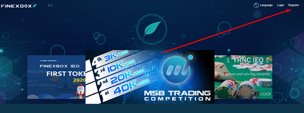
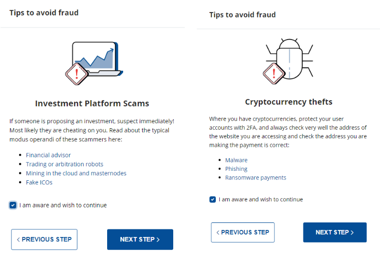
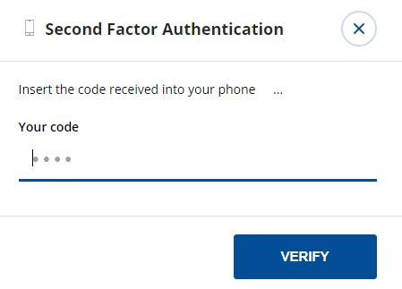
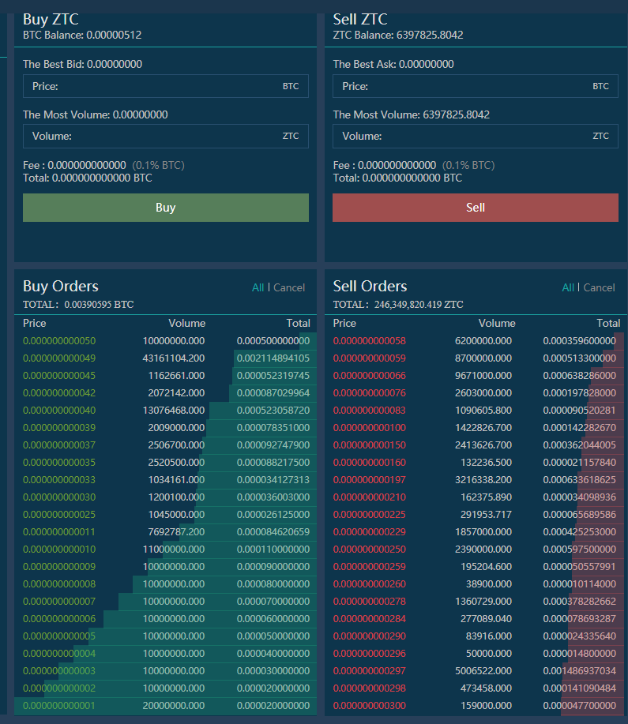

## **مؤشر:**

1.  Bit2Me التسجيل
2.  كيف يمكنني التحقق من حسابي في Bit2Me؟ خطوة بخطوة...
3.  شراء البيتكوين
4.  تسجيل Finexbox
5.  نقل Bitcoins الخاص بك من Bit2Me المحفظة الخاصة بك إلى محفظة Finexbox الخاص بك
6.  إرسال Bitcoins إلى محفظة Finexbox
7.  شراء زينتس
8.  أرسل زينتس إلى محفظتي الخاصة

## 1. Bit2Me التسجيل

الوصول إلى Bit2Me: <https://bit2me.com/register?r=AOP-U0D-KIU>

كل ما عليك القيام به هو الذهاب إلى الوصول إلى القسم أو انقر على هذا [الارتباط](https://bit2me.com/es/registro?r=AOP-U0D-KIU).

[**اكثر**]  <https://support.bit2me.com/en/support/home> معلومات Bit2Me

ونضغط على زر التسجيل. أدخل بريدك الإلكتروني وكلمة المرور. قبول الشروط والأحكام التي نقدمها لك. ثم عليك فقط النقر على زر التسجيل.

بمجرد تسجيلك، أدخل بريدك الإلكتروني وستجد رسالة Bit2Me هذه للتحقق من حسابك. انقر على **تاكيد** **البريد الإلكتروني**. إذا لم يعمل الزر، انسخ الرابط المرفق إلى المتصفح لتأكيده. بهذه الطريقة السهلة والبسيطة سيكون لديك حساب البريد الإلكتروني الخاص بك التحقق. (إذا لم تكن قد تلقيت الرسالة بعد، انقر فوق **إعادة إرسال البريد الإلكتروني** زر. 

> تذكر أن تحقق مجلد البريد المزعج الخاص بك كذلك

عند تأكيد حسابك، يمكنك تعديل ملفك الشخصي وإنشاء اسم مستخدم وربط رقم هاتفك إذا كنت ترغب في ذلك.

تهانينا ، أنت بالفعل مستخدم Bit2Me! بعد التسجيل أنت على بعد خطوة واحدة أقرب إلى العملات المشفرة. إذا كنت تريد أن تعطي ما يلي انقر على الزر أدناه لتبدأ مع إنشاء محفظتك في [Bit2Me المحفظة](https://wallet.bit2me.com/). إنشاء محفظة الآن!

## 2. كيف يمكنني التحقق من حسابي Bit2Me؟ خطوة بخطوة...

من أجل شراء وبيع على Bit2Me تحتاج إلى التحقق من الحساب. للقيام بذلك، علينا أولاً ملء بياناتنا (الاسم، اللقب، رقم الهوية، الجنسية، تاريخ الميلاد ...)

1.  نفتح صفحة Bit2Me، ونضغط على **الوصول** (في الأعلى)

    

2.  نحن نتواصل مع البريد الإلكتروني وكلمة المرور الخاصة بنا.

    

3.  مرة واحدة في **عام** اكتمال الملف (البريد الإلكتروني، المستخدم والهاتف)، انتقل إلى **الهويه** جزء لإكمال التحقق.

    

4.  **يتم التحقق في 3 خطوات:** المعلومات والهوية وتحميل الصور لالتقاط الصور بشكل صحيح ، يمكنك اتباع دليلنا هنا : [كيف يجب التقاط صور التسجيل؟](https://support.bit2me.com/en/support/solutions/articles/35000051157-how-should-you-take-the-registration-photos-)

5.  وبمجرد ملء جميع البيانات، ستكون إدارة التحقق لدينا مسؤولة عن إجراء التحقق وقبول أو رفض الإشارة إلى السبب (المادة: لماذا تم رفض التحقق الخاص بي؟)

> يوتيوب (الإسبانية): [👩 🏫 TUTORIAL كومو كومبرار بيتكوين fácil con TARJETA de débito en Bit2Me](https://www.youtube.com/watch?v=u2yXd0pTr5k) 

## 3. شراء Bitcoins

الآن يمكنك الحصول على Bitcoins عن طريق بطاقة الائتمان، والتحويل المصرفي ونظام الدفع الأخرى.

هل انقر على زر شراء وحدد:

-   ماذا تريد أن تشتري؟ -> بيتكوين (BTC)
-   كم تريد أن تدفع؟ -> حدد كم تريد شراء
-   أين تريد الحصول عليها؟ -> يمكنك اختيار محفظة بيتكوين أو إضافة المزيد من المحافظ
-   حدد كيف تريد الدفع

الآن يمكننا إرسال Bitcoins لدينا إلى محفظة Finexbox

## 4. تسجيل Finexbox

الانتقال إلى [finexbox.com](https://www.finexbox.com/Reg/register/referrer/371)

 انقر على زر التسجيل

أدخل بريدك الإلكتروني في Gmail إذا أمكن، وكلمة مرور مرتين

`(Password length between 6-20 english characters or number)`

\*إذا كنت تريد، يمكنك إضافة معرف الإحالة: **371\***

تقوم Finexbox بتنفيذ نظام أمان من خطوتين لمنع سرقة العملات الرقمية ، بحيث حتى لو اكتشفوا كلمة المرور الخاصة بك ، فلن يتمكنوا من الدخول بدون الرمز الذي يتم إنشاؤه كل 30 ثانية على هاتفك الخلوي.

على سبيل المثال، يمكننا استخدام [**جوجل المصادقة**](https://play.google.com/store/apps/details?id=com.google.android.apps.authenticator2&hl=es&gl=US)، أو لـ Apple مع [Authenticato‪r](https://apps.apple.com/es/app/authenticator/id766157276).

## 5. نقل Bitcoins الخاص بك من Bit2Me المحفظة الخاصة بك إلى محفظة Finexbox الخاص بك

-   انتقل إلى قسم التوازن وابحث عن رمز Bitcoin/BTC.
-   انقر على الزر الموجود على اليمين الذي يشير إلى **ايداع**.

سوف Finexbox إنشاء محفظة بيتكوين فريدة من نوعها لك

نسخ عنوان محفظتك

## 6. إرسال Bitcoins إلى محفظة Finexbox الخاص بك

افتح محفظتك في Bit2Me

### قبول كافة تحذيرات الأمان

 

سوف Bit2Me نرسل لك رسالة إلى هاتفك، مع رمز الحماية.

> تحذير: النقل هو **غير فوري**، يمكن أن يستغرق ما يصل إلى 30-45 دقيقة.

## 7. شراء Zents

-   العودة إلى الشاشة الرئيسية Finexbox
-   أولاً، قم بتكوين عامل المصادقة الثاني بالنقر على زر الأمان في لوحة المستخدم، هذه عملية لمرة واحدة.

بمجرد اكتمال التكوين، يمكننا الاستمرار.

-   تحقق مما إذا كانت البت كوين قد وصلت

-   عندما يصلون، انقر على شعار Finexbox، في الزاوية اليسرى العليا
-   سترى جميع العملات التي يمكن تبادلها، وفوقها شريط أزرق فاتح يتم وضع علامة عليه علامة التبويب BTC.
-   على يمينه يمكنك الكتابة للبحث عن العملات

> تحذير: إذا كنت الوصول من الهاتف الذكي، سيكون لديك لتعيينه **افقيا**. 

-   نوع ZTC وسوف ترى فقط الزوج نحن مهتمون في ZentCash (ZTC / BTC)

-   انقر عليه

-   سوف تدخل BTC للوحة تبادل ZTC.

-   انقر في النجمة:
    
-   انتقل إلى أسفل اللوحة حيث سترى كلا **شراء** و **بيع أوامر**.

الـ **يسار** العمود هو الناس الذين يريدون **شراء** زينتس، **يمين** العمود هو الناس الذين يريدون **بيع** زينتس، (زينتس)

يمكنك محاولة لبيع Zents و / أو شرائها بالسعر الذي تريده، إذا كنت ترغب في شراء أو بيع على الفور، فقط حدد **أول أمر** في كل عمود.

**للشراء:**

-   حدد الأول **عمود أحمر** الصف على اليمين.
-   ستظهر البيانات باللون الأخضر **شراء** مربع.
-   انقر على **شراء** زر

**للبيع:**

-   حدد الأول **عمود أخضر** الصف على اليسار.
-   ستظهر البيانات باللون الأخضر **بيع** مربع.
-   انقر على **بيع** زر

### هل يمكنني البيع بسعر معين؟

بالطبع، إذا كنت ترغب في شراء بسعر معين

-   إذا كنت ترغب في تعيين سعر صرف محدد، أدخله في حقل "السعر" في عمود "أوامر الشراء" ووضع الكمية التي ترغب في شرائها في حقل "الحجم".

|  |  |
| ---------------------------------------------- | -------------------------------------------- |
|                                                |                                              |

يمكنك إلغاء أوامرك:

#### 💃💃**تهانينا، لديك بالفعل Zents الخاص بك!** 💃💃

## 8. أرسل زينتس إلى محفظتي الخاصة

نوصي بتخزين Zents في محافظ شخصية، لهذا لديك [محفظة Zent على الويب](https://wallet.zent.cash/) و [تطبيق المحمول](https://play.google.com/store/apps/details?id=cash.zent.mobileapp&hl=es&gl=US)، في الوقت الراهن هو فقط لالروبوت. 

-   <https://play.google.com/store/apps/details?id=cash.zent.mobileapp&hl=es&gl=US> 
-   <https://wallet.zent.cash/>

انقر على البريد الإلكتروني الخاص بك في الزاوية اليمنى العليا، وسوف يأخذك إلى لوحة المستخدم الخاص بك.

انقر على إخفاء أرصدة صفر: 

في زنت صف الصحافة **سحب** زر:

**محفظة Zent الخاصة بك**

لسحب الخاص بك Zent النقدية، تحتاج محفظتك الخاصة خارج من تبادل Finexbox، يمكنك استخدام تطبيق الهاتف المحمول، محفظة ويب أو زنت ثنائي لتوليد محفظتك الخاصة.

نسخ عنوانك من تطبيق الجوال، محفظة ويب أو زينت ثنائي.

انقر على **+إضافة عنوان** زر ولصق عنوان محفظتك

-   ثم حدد Zents الذي تريد إرساله (**2.5 مليون كحد أقصى**)
-   انقر على **إرسال زر →** وسوف ترسل إلى البريد الإلكتروني الخاص بك رمز 4 أرقام، عندما يصل كتابتها في الميدان إلى يسار زر إرسال.
-   وأخيرا، افتح تطبيق المصادقة وانسخ الأرقام التي يتم إنشاؤها عشوائيا كل ثانية X، في الحقل المفتاح من جوجل 2FA
-   اضغط على **المعاملات** زر

سوف يظهر طلبك في "سحب المحفوظات" كمواد معلقة.

> تحذير: قد يستغرق تنفيذ ما يصل إلى 24 ساعة. 

> 🚧
> **لأسباب أمنية، قد لا ترى رسالة "مكتمل" عند إجراء المعاملة، ولكن رسالة تشير إلى أنه إذا لم يظهر في 5 دقائق في التاريخ، يجب عليك إرسال بريد إلكتروني إلى دعم Finexbox، في هذه الحالة، إرسال بريد إلكتروني لإعادة تنشيط السحب. **
> 🚧
