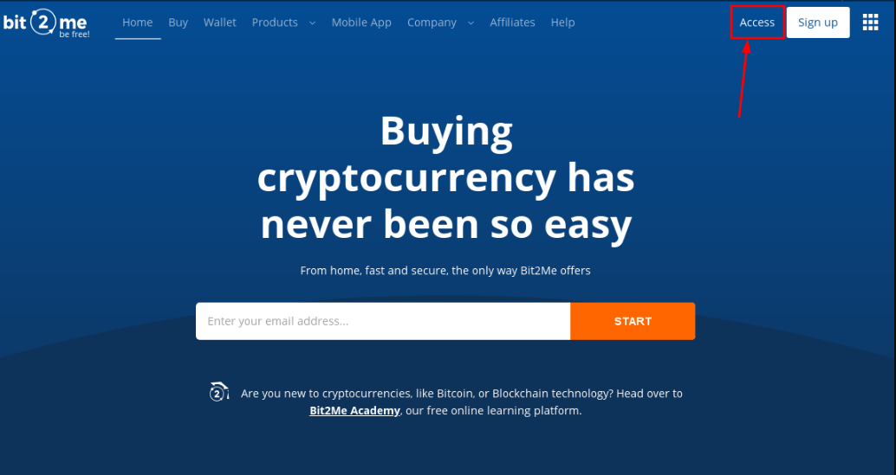
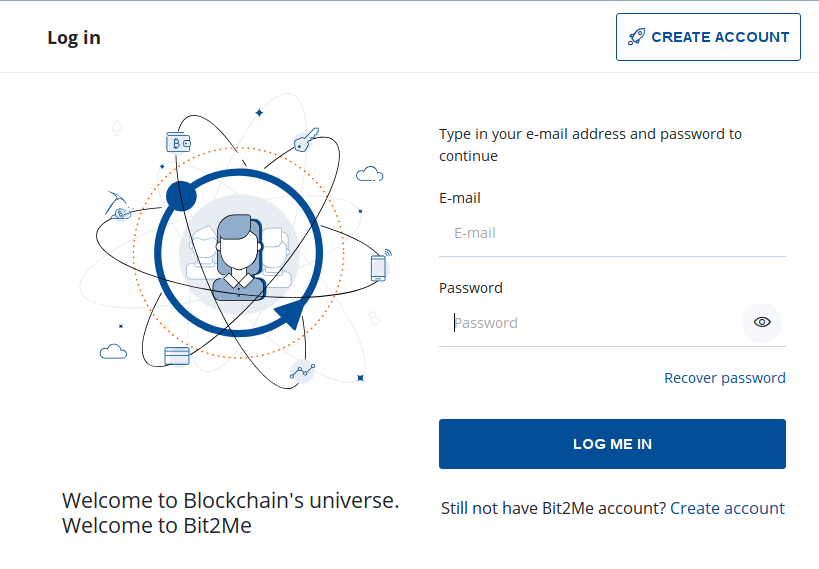
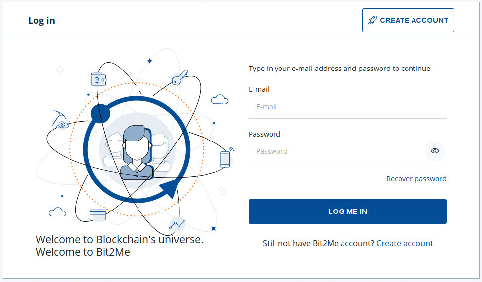
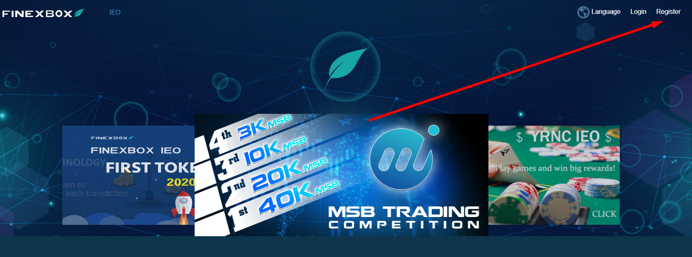

## **Index:**

1.  Bit2Me-Registrierung
2.  Wie verifiziere ich mein Bit2Me-Konto? Schritt für Schritt...
3.  Kaufen Bitcoins
4.  Finexbox Registrierung
5.  Übertragen Sie Ihre Bitcoins von Ihrem Bit2Me Wallet auf Ihre Finexbox Wallet
6.  Senden Sie Bitcoins an Ihre Finexbox Wallet
7.  Kaufen Zents
8.  Senden Sie meine Zents an meine eigene Brieftasche

## 1. Bit2Me-Registrierung

Zugriff auf Bit2Me: <https://bit2me.com/register?r=AOP-U0D-KIU>

Alles, was Sie tun müssen, ist zum Access-Bereich zu gehen oder klicken Sie auf diese [verbinden](https://bit2me.com/es/registro?r=AOP-U0D-KIU).

[**Mehr**]  <https://support.bit2me.com/en/support/home> Bit2Me Info

Wir klicken auf den Registrierungs-Button. Geben Sie Ihre E-Mail-Adresse und Ihr Passwort ein. Akzeptieren Sie die Bedingungen, die wir Ihnen vorlegen. Dann müssen Sie nur noch auf den Register-Button klicken.

Sobald Sie sich registriert haben, geben Sie Ihre E-Mail-Adresse ein und Sie werden diese Bit2Me-Nachricht finden, um Ihr Konto zu überprüfen. Klicken Sie auf **Bestätigen** **E-Mail**. Wenn die Schaltfläche nicht funktioniert, kopieren Sie den angehängten Link in Ihren Browser, um ihn zu bestätigen. Auf diese einfache und einfache Weise werden Sie Ihr E-Mail-Konto verifizieren lassen. (Wenn Sie die Nachricht noch nicht erhalten haben, klicken Sie auf **E-Mail erneut senden** Schaltfläche. 

> Denken Sie daran, auch Ihren Spam-Ordner zu überprüfen

Wenn Sie Ihr Konto bestätigen, können Sie Ihr Profil bearbeiten, einen Benutzernamen erstellen und Ihre Telefonnummer verknüpfen, wenn Sie möchten.

Herzlichen Glückwunsch, Sie sind bereits bit2Me Benutzer! Nach der Registrierung sind Sie Kryptowährungen einen Schritt näher. Wenn Sie den folgenden Klick auf die Schaltfläche unten geben möchten, um mit der Erstellung Ihrer Brieftasche in [Bit2Me Brieftasche](https://wallet.bit2me.com/). ERSTELLEN SIE GELDBÖRSE JETZT!

## 2. Wie verifiziere ich mein Bit2Me-Konto? Schritt für Schritt...

Um auf Bit2Me zu kaufen und zu verkaufen, müssen Sie das Konto überprüfen. Dazu müssen wir zunächst unsere Daten (Name, Nachname, Identitätsnummer, Nationalität, Geburtsdatum ...) eingeben.

1.  Wir öffnen die Bit2Me-Seite und klicken auf **Zugriff** (oben)

    

2.  Wir verbinden uns mit unserer E-Mail und Passwort.

    

3.  Einmal die **Allgemein** Profil (E-Mail, Benutzer und Telefon) abgeschlossen ist, gehen wir zum **Identität** , um die Überprüfung abzuschließen.

    

4.  **Die Überprüfung erfolgt in 3 Schritten:** INFORMATIONEN, IDENTITY UND UPLOAD FOTOS Um die Fotos richtig zu machen, können Sie unserem Leitfaden hier folgen: [Wie sollten Sie Registrierungsfotos machen?](https://support.bit2me.com/en/support/solutions/articles/35000051157-how-should-you-take-the-registration-photos-)

5.  Sobald alle Daten ausgefüllt sind, ist unsere Verifizierungsabteilung für die Überprüfung und Annahme oder Verweigerung der Angabe des Grunds zuständig (Artikel: Warum wurde meine Überprüfung verweigert?)

> Youtube (Spanisch): [👩 🏫 TUTORIAL como COMPRAR BITCOIN fécil con TARJETA de débito en Bit2Me](https://www.youtube.com/watch?v=u2yXd0pTr5k) 

## 3. Kaufen Bitcoins

Jetzt können Sie Bitcoins per Kreditkarte, Banküberweisung und andere Zahlungssystem erhalten.

Klicken Sie auf Kaufen und wählen Sie:

-   Was möchten Sie kaufen? --> Bitcoin (BTC)
-   Wie viel möchten Sie bezahlen? --> Wählen Sie, wie viel Sie kaufen möchten
-   Wo möchten Sie sie erhalten? --> können Sie Ihre Bitcoin-Wallet auswählen oder weitere Wallets hinzufügen
-   Wählen Sie aus, wie Sie bezahlen möchten

Jetzt können wir unsere Bitcoins an unsere Finexbox Brieftasche senden

## 4. Finexbox Registrierung

Gehe zu [finexbox.com](https://www.finexbox.com/Reg/register/referrer/371)

 Klicken Sie auf den Registrierungsbutton

Geben Sie nach Möglichkeit Ihre Gmail-E-Mail und zweimal ein Passwort ein

`(Password length between 6-20 english characters or number)`

\*Wenn Sie möchten, können Sie Empfehlungs-ID hinzufügen: **371\***

Finexbox implementiert ein zweistufiges Sicherheitssystem, um Kryptowährungsdiebstahl zu verhindern, so dass sie, selbst wenn sie Ihr Passwort herausfinden, nicht ohne den Code eingeben können, der alle 30 Sekunden auf Ihrem Handy generiert wird.

Zum Beispiel können wir die [**Google Authenticator**](https://play.google.com/store/apps/details?id=com.google.android.apps.authenticator2&hl=es&gl=US), oder für Apple mit [Authenticato‪r](https://apps.apple.com/es/app/authenticator/id766157276).

## 5. Übertragen Sie Ihre Bitcoins von Ihrem Bit2Me Wallet auf Ihre Finexbox Wallet

-   Gehen Sie zum Balance-Bereich und suchen Sie nach dem Bitcoin/BTC-Symbol.
-   Klicken Sie auf die Schaltfläche auf der rechten Seite, die **Einzahlung**.

Finexbox erstellt eine Bitcoin Wallet, die für Sie einzigartig ist

Kopieren Sie Ihre Wallet-Adresse

## 6. Senden Sie Bitcoins an Ihre Finexbox Wallet

Öffnen Sie Ihre Bit2Me-Wallet

### Akzeptieren Sie alle Sicherheitswarnungen

 

Bit2Me sendet Ihnen eine Nachricht mit dem Sicherheitscode an Ihr Telefon.

> :Warnung: Die Übertragung ist **nicht augenblicklich**, kann es bis zu 30-45 Minuten dauern.

## 7. Kaufen Zents

-   Zurück zum Finexbox-Hauptbildschirm
-   Konfigurieren Sie zunächst den zweiten Authentifizierungsfaktor, indem Sie auf die Schaltfläche Sicherheit in Ihrem Benutzerfenster klicken, dies ist ein einmaliger Vorgang.

Sobald die Konfiguration abgeschlossen ist, können wir fortfahren.

-   Prüfen Sie, ob Ihre Bitcoins angekommen sind

-   Wenn sie angekommen sind, klicken Sie auf das Finexbox-Logo in der oberen linken Ecke
-   Sie sehen alle Währungen, die umgetauscht werden können, und darüber einen hellblauen Balken, auf dem die BTC-Registerkarte markiert ist.
-   Rechts davon können Sie die Suche nach Währungen eingeben

> :Warnung: Wenn Sie von einem Smartphone aus zugreifen, müssen Sie es **Horizontal**. 

-   Geben Sie ZTC ein und Sie werden nur das Paar sehen, das wir an ZentCash (ZTC/BTC) interessieren

-   Klicken Sie darauf

-   Sie geben das Austauschfeld BTC für ZTC ein.

-   Klicken Sie in den Stern:
    
-   Scrollen Sie zum unteren Rand des Bedienfelds, wo Sie beide **Kaufen** Und **Verkaufsaufträge**.

das **Links** Spalte sind Personen, die **Kaufen** Zents, die **Rechts** Spalte sind Personen, die **Verkaufen** Zents.

Sie können versuchen, Zents zu verkaufen und/oder sie zu dem gewünschten Preis zu kaufen, wenn Sie sofort kaufen oder verkaufen möchten, wählen Sie einfach die **Erste Bestellung** in jeder Spalte.

**Kaufen:**

-   Wählen Sie die erste **rote Spalte** Reihe auf der rechten Seite.
-   Die Daten werden im grünen **Kaufen** Box.
-   Klicken Sie auf die **Kaufen** Schaltfläche

**Zu verkaufen:**

-   Wählen Sie die erste **grüne Spalte** Zeile auf der linken Seite.
-   Die Daten werden im grünen **Verkaufen** Box.
-   Klicken Sie auf die **Verkaufen** Schaltfläche

### Kann ich zu einem bestimmten Preis verkaufen?

Natürlich, Wenn Sie zu einem bestimmten Preis kaufen möchten

-   Wenn Sie einen bestimmten Wechselkurs festlegen möchten, geben Sie diesen in das Feld "Preis" der Spalte "Kaufen" ein und geben Sie die Menge, die Sie kaufen möchten, in das Feld "Volumen" ein.

|  |  |
| ---------------------------------------------- | -------------------------------------------- |
|                                                |                                              |

Sie können Ihre Bestellungen stornieren:

#### 💃💃**Herzlichen Glückwunsch, Sie haben bereits Ihre Zents!** 💃💃

## 8. Senden Sie meine Zents an meine eigene Brieftasche

Wir empfehlen, Zents in persönlichen Portemonnaies zu speichern, dafür haben Sie die [Zent Wallet im Web](https://wallet.zent.cash/) Und [Mobile App](https://play.google.com/store/apps/details?id=cash.zent.mobileapp&hl=es&gl=US), vorerst ist es nur für Android. 

-   <https://play.google.com/store/apps/details?id=cash.zent.mobileapp&hl=es&gl=US> 
-   <https://wallet.zent.cash/>

Klicken Sie auf Ihre E-Mail in der oberen rechten Ecke, es wird Sie zu Ihrem Benutzer-Panel zu nehmen.

Klicken Sie auf Nullsalden ausblenden: 

In Zent-Reihenpresse **Zurückziehen** Schaltfläche:

**Ihre eigene Zent Wallet**

Um Ihr Zent Cash abheben, benötigen Sie Ihre eigene Brieftasche außerhalb von Finexbox Exchanger, können Sie die mobile Anwendung, die Web-Wallet oder Zent Binary verwenden, um Ihre eigene Brieftasche zu generieren.

Kopieren Sie Ihre Adresse aus Mobile App, Web Wallet oder Zent Binär.

Klicken Sie auf **+Adresse hinzufügen** Taste und fügen Sie Ihre Wallet-Adresse

-   Wählen Sie dann die Zents aus, die Sie senden möchten (**2,5 Millionen maximal**)
-   Klicken Sie auf **Senden von Schaltflächen →** Es wird an Ihre E-Mail einen 4-stelligen Code senden, wenn es ankommt, schreiben Sie es im Feld links von der Schaltfläche Senden.
-   Öffnen Sie schließlich die Authenticator-Anwendung und kopieren Sie die Zahlen, die alle X Sekunden zufällig generiert werden, im Feld Der Schlüssel aus Google 2FA
-   Drücken Sie die **Transaktion** Schaltfläche

Ihre Bestellung wird in der Auszahlungshistorie als ausstehend angezeigt.

> :Warnung:Die Ausführung kann bis zu 24 Stunden dauern. 

> 🚧
> **Aus Sicherheitsgründen wird die Meldung "Abgeschlossen" möglicherweise nicht angezeigt, wenn Sie die Transaktion vornehmen, aber eine Meldung, die darauf hinweist, dass Sie, wenn sie in 5 Minuten nicht im Verlauf erscheint, eine E-Mail an den Finexbox-Support senden müssen, in diesem Fall senden Sie ihnen eine E-Mail, um die Auszahlung erneut zu aktivieren. **
> 🚧
