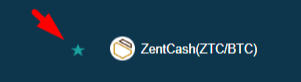
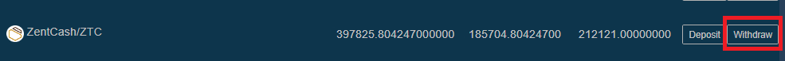

## **指数：**

1.  位2Me注册
2.  如何验证我的Bit2Me帐户？一步一步...
3.  购买比特币
4.  精细框注册
5.  将比特币从Bit2Me钱包转移到您的Finexbox钱包
6.  将比特币发送到您的芬克斯盒钱包
7.  购买赞茨
8.  把我的禅宗送到我自己的钱包里

## 1. 位 2Me 注册

访问位2Me：<https://bit2me.com/register?r=AOP-U0D-KIU>

所有你需要做的就是去访问部分或点击这个[链接](https://bit2me.com/es/registro?r=AOP-U0D-KIU).

[**更**]  <https://support.bit2me.com/en/support/home>位2我信息

我们单击"注册"按钮。输入您的电子邮件和密码。接受我们向您提交的条款和条件。然后，您只需要单击"注册"按钮。

注册后，输入您的电子邮件，您将找到此Bit2Me消息来验证您的帐户。单击**确认** **电子邮件**.如果按钮不起作用，请复制所附链接到浏览器以确认它。在这个简单明了的方式，你将有你的电子邮件帐户验证。（如果您尚未收到消息，请单击**重新发送电子邮件**按钮。

> 记得检查您的垃圾邮件文件夹以及

当您确认您的帐户时，您可以编辑您的个人资料，创建一个用户名，并链接您的电话号码，如果你愿意。

恭喜你，你已经是一个位2我的用户！注册后，您离加密货币又近了一步。如果你想给以下点击下面的按钮，开始创建你的钱包[位2Me钱包](https://wallet.bit2me.com/).立即创建钱包！

## 2.如何验证我的Bit2Me帐户？一步一步...

为了在Bit2Me上买入和卖出，您需要验证该帐户。为此，我们首先必须填写我们的数据（姓名、姓氏、身份证号码、国籍、出生日期。。。。。。）

1.  我们打开位2Me页面，然后单击**访问**（在顶部）

    

2.  我们使用电子邮件和密码进行连接。

    

3.  一旦**常规**配置文件（电子邮件，用户和电话）已完成，我们转到**身份**部分完成验证。

    

4.  **验证分三个步骤完成：**信息，身份和上传照片要正确拍摄照片，您可以按照我们的指南在这里：[您应该如何拍摄注册照片？](https://support.bit2me.com/en/support/solutions/articles/35000051157-how-should-you-take-the-registration-photos-)

5.  一旦所有数据都已填写，我们的验证部门将负责进行验证，并接受或否认说明原因（文章：为什么我的验证被拒绝？

> 尤图伯（西班牙语）：[👩 🏫教程科莫公司比特币费西尔 · 康 · 塔耶塔 · 德 · 德比托 · 恩 · 比特 2me](https://www.youtube.com/watch?v=u2yXd0pTr5k) 

## 3. 购买比特币

现在，您可以通过信用卡、银行转账和其他支付系统获取比特币。

单击"购买"按钮并选择：

-   你想买什么？->比特币（BTC）
-   你想付多少钱？->选择你想买多少
-   您想在哪里接收它们？->你可以选择你的比特币钱包或添加更多的钱包
-   选择要支付方式

现在我们可以把我们的比特币发送到我们的Finexbox钱包

## 4. 精细盒注册

转到(G)[finexbox.com](https://www.finexbox.com/Reg/register/referrer/371)

单击注册按钮

如果可能，请输入您的 Gmail 电子邮件，并输入密码两次

`(Password length between 6-20 english characters or number)`

\*如果您愿意，您可以添加转介ID：**371\***

Finexbox 实现了两步安全系统，以防止加密货币被盗，因此即使他们发现了您的密码，如果没有手机上每 30 秒生成一次的代码，他们也无法输入。

例如，我们可以使用[**谷歌身份验证器**](https://play.google.com/store/apps/details?id=com.google.android.apps.authenticator2&hl=es&gl=US)，或苹果与[Authenticato‪r](https://apps.apple.com/es/app/authenticator/id766157276).

## 5. 将比特币从 Bit2Me 钱包转移到您的 Finexbox 钱包

-   转到余额部分并查找比特币/BTC 符号。
-   单击右侧指示的按钮**存款**.

Finexbox 将创建一个您独有的比特币钱包

复制您的钱包地址

## 6. 将比特币发送到您的 Finexbox 钱包

打开你的Bit2Me钱包

### 接受所有安全警告

 

Bit2Me 会向您发送带有安全代码的消息。

> ：警告：传输是**不是瞬间的**，可能需要长达30-45分钟。

## 7. 购买赞茨

-   返回到芬克斯盒主屏幕
-   首先，通过单击用户面板中的"安全"按钮来配置第二个身份验证因子，这是一次性操作。

一旦配置完成，我们可以继续。

-   检查您的比特币是否已到达

-   当他们到达时，点击Finexbox标志，在左上角
-   您将看到所有可以兑换的货币，并在上面看到一个浅蓝色条，上面标有 BTC 选项卡。
-   在它的右边，你可以键入搜索货币

> ：警告：如果您正在从智能手机访问，您必须设置它**水平**.

-   键入 ZTC，您将只看到我们对 ZentCash 感兴趣的对（ZTC/BTC）

-   单击它

-   您将进入BTC的ZTC交换面板。

-   单击星座：
    
-   滚动到面板的底部，在那里您将看到两者**买**和**销售订单**.

**左**列是谁想要的人**买**赞茨，**右**列是谁想要的人**卖**赞茨

您可以尝试以您想要的价格出售 Zents 和/或购买它们，如果您想立即购买或出售，只需选择**第一个订单**在每个列中。

**购买：**

-   选择第一个**红色列**在右边的行。
-   数据将显示在绿色**买**箱。
-   单击**买**按钮

**要销售：**

-   选择第一个**绿色列**左侧行。
-   数据将显示在绿色**卖**箱。
-   单击**卖**按钮

### 我可以以一定的价格出售吗？

当然，如果你想以一定的价格购买

-   如果您想设置特定的交换价格，请在"买入订单"列的"价格"字段中输入该字段，并将希望购买的数量放在"批量"字段中。

|  |  |
| ---------------------------------------------- | -------------------------------------------- |
|                                                |                                              |

您可以取消订单：

#### 💃💃**恭喜你，你已经有你的赞特！**💃💃

## 8. 把我的 Zents 寄到我自己的钱包里

我们建议将 Zents 存储在个人钱包中，为此您拥有[Zent 钱包在网络上](https://wallet.zent.cash/)和[移动应用程序](https://play.google.com/store/apps/details?id=cash.zent.mobileapp&hl=es&gl=US)，现在它只为安卓系统。

-   <https://play.google.com/store/apps/details?id=cash.zent.mobileapp&hl=es&gl=US> 
-   <https://wallet.zent.cash/>

点击右上角的电子邮件，它会带您到您的用户面板。

单击隐藏零余额：

在赞特行按下**撤回**按钮：

**您自己的赞特钱包**

要提取您的 Zent 现金，您需要在 Finexbox 交换器之外使用自己的钱包，您可以使用移动应用程序、Web 钱包或 Zent Binary 生成自己的钱包。

从移动应用程序、Web 钱包或 Zent 二进制文件复制您的地址。

单击**+添加地址**按钮并粘贴您的钱包地址

-   然后选择要发送的赞特（**最高 250 万**)
-   单击**发送按钮→**它会向您的电子邮件发送一个 4 位代码，当它到达时将其写在"发送"按钮左侧的字段中。
-   最后，打开身份验证器应用程序并复制每 X 秒随机生成的数字，该字段中的密钥来自 Google 2FA
-   按下**交易**按钮

您的订单将显示为待定撤回历史记录。

> ：警告：执行可能需要长达 24 小时。

> 🚧
> **出于安全原因，在进行交易时，您可能看不到"已完成"消息，但消息表明，如果在 5 分钟内没有显示在历史记录中，您必须向 Finexbox 支持部门发送电子邮件，在这种情况下，向他们发送电子邮件以重新激活提款。**
> 🚧
