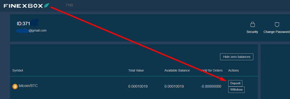
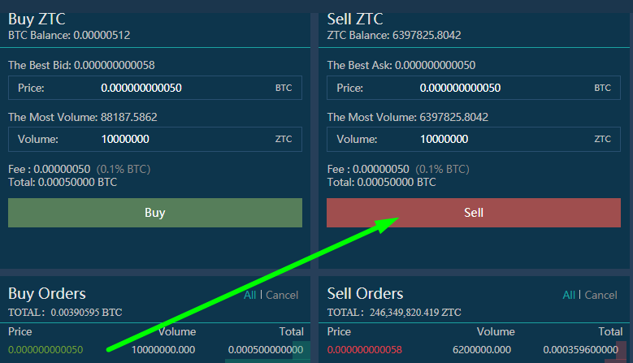
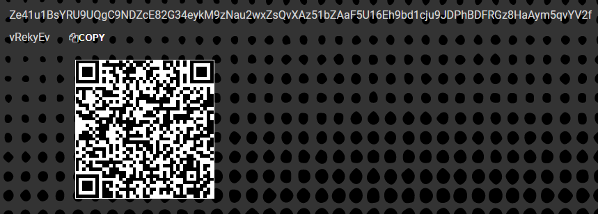
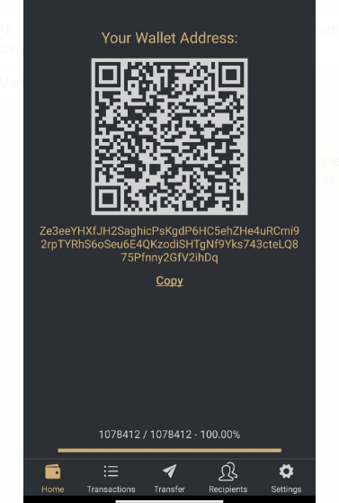

## **Índice:**

1.  Registro Bit2Me
2.  ¿Cómo verifico mi cuenta bit2me? Paso a paso...
3.  Comprar Bitcoins
4.  Registro Finexbox
5.  Transfiere tus Bitcoins desde tu Monedero Bit2Me a tu Billetera Finexbox
6.  Envía Bitcoins a tu billetera Finexbox
7.  Comprar Zents
8.  Envía mis Zents a mi propia cartera

## 1. Registro Bit2Me

Acceso a Bit2Me: <https://bit2me.com/register?r=AOP-U0D-KIU>

Todo lo que tienes que hacer es ir a la sección de Acceso o hacer clic en este [Enlace](https://bit2me.com/es/registro?r=AOP-U0D-KIU).

[**Más**]  <https://support.bit2me.com/en/support/home> Información de Bit2Me

Hacemos clic en el botón Registrar. Introduzca su correo electrónico y contraseña. Acepte los términos y condiciones que le presentamos. A continuación, sólo tiene que hacer clic en el botón Registrar.

Una vez que se haya registrado, introduzca su correo electrónico y encontrará este mensaje de Bit2Me para verificar su cuenta. Haga clic en **Confirmar** **Correo electrónico**. Si el botón no funciona, copia el enlace adjunto a tu navegador para confirmarlo. De esta manera fácil y sencilla tendrá su cuenta de correo electrónico verificada. (Si aún no ha recibido el mensaje, haga clic en el botón **Enviar correo electrónico** Botón. 

> Recuerda revisar tu carpeta de spam también

Cuando confirmes tu cuenta, puedes editar tu perfil, crear un nombre de usuario y vincular tu número de teléfono si lo deseas.

¡Felicidades, ya eres un usuario de Bit2Me! Después de registrarse usted está un paso más cerca de las criptomonedas. Si desea dar el siguiente clic en el botón de abajo para comenzar con la creación de su billetera en [Cartera Bit2Me](https://wallet.bit2me.com/). ¡CREA Wallet AHORA!

## 2. ¿Cómo verifico mi cuenta de Bit2Me? Paso a paso...

Para comprar y vender en Bit2Me es necesario verificar la cuenta. Para ello, primero tenemos que rellenar nuestros datos (nombre, apellidos, número de identidad, nacionalidad, fecha de nacimiento...)

1.  Abrimos la página Bit2Me y hacemos clic en **Acceso** (en la parte superior)

    

2.  Nos conectamos con nuestro correo electrónico y contraseña.

    

3.  Una vez que el **General** (correo electrónico, usuario y teléfono) se completa, vamos a la **Identidad** parte para completar la verificación.

    

4.  **La verificación se realiza en 3 pasos:** INFORMACIÓN, IDENTIDAD Y SUBIR FOTOS Para tomar las fotos correctamente, puede seguir nuestra guía aquí: [¿Cómo debe tomar fotos de registro?](https://support.bit2me.com/en/support/solutions/articles/35000051157-how-should-you-take-the-registration-photos-)

5.  Una vez rellenados todos los datos, nuestro Departamento de Verificación se encargará de realizar la verificación y aceptar o denegar indicando la razón (Artículo: ¿Por qué se ha denegado mi verificación?)

> Youtube: [👩 🏫 TUTORIAL COMO COMPRAR BITCOIN fácil con TARJETA de débito en Bit2Me](https://www.youtube.com/watch?v=u2yXd0pTr5k) 

## 3. Comprar Bitcoins

Ahora puede obtener Bitcoins con tarjeta de crédito, transferencia bancaria y otros sistemas de pago.

Haga clic en el botón Comprar y seleccione:

-   ¿Qué quieres comprar? --> Bitcoin (BTC)
-   ¿Cuánto quieres pagar? --> Seleccione cuánto desea comprar
-   ¿Dónde quieres recibirlos? --> puede seleccionar su billetera Bitcoin o agregar más carteras
-   Seleccione cómo desea pagar

Ahora podemos enviar nuestros Bitcoins a nuestra billetera Finexbox

## 4. Registro Finexbox

Vaya a [Finexbox.com](https://www.Finexbox.com/Reg/register/referrer/371)

 Haga clic en el botón de registro

Introduzca su correo electrónico de Gmail si es posible, y una contraseña dos veces

`(Password length between 6-20 english characters or number)`

Si lo desea, puede agregar el ID de referencia: **371**

Finexbox implementa un sistema de seguridad en dos pasos para prevenir el robo de criptomonedas, de modo que incluso si descubren su contraseña, no podrán ingresar sin el código que se genera cada 30 segundos en su teléfono móvil.

Por ejemplo, podemos usar la [**Autenticador de Google**](https://play.google.com/store/apps/details?id=com.google.android.apps.authenticator2&hl=es&gl=US), o para Apple con [Authenticato‪r](https://apps.apple.com/es/app/authenticator/id766157276).

## 5. Transfiere tus Bitcoins desde tu Monedero Bit2Me a tu Billetera Finexbox

-   Vaya a la sección de balance y busque el símbolo Bitcoin/BTC.
-   Haga clic en el botón de la derecha que indica **Depósito**.

Finexbox creará una cartera Bitcoin única para ti

Copia tu dirección de Wallet

## 6. Envía Bitcoins a tu Billetera Finexbox

Abre tu billetera Bit2Me

### Aceptar todas las advertencias de seguridad

 

Bit2Me le enviará un mensaje a su teléfono, con el código de seguridad.

> :warning: La transferencia es **no instantáneo**, puede tardar hasta 30-45 minutos.

## 7. Comprar Zents

-   De vuelta a la pantalla principal de Finexbox
-   En primer lugar, configure el segundo factor de autenticación haciendo clic en el botón Seguridad del panel de usuario, se trata de una operación única.

Una vez completada la configuración, podemos continuar.

-   Compruebe si sus bitcoins han llegado

-   Cuando hayan llegado, haga clic en el logotipo de Finexbox, en la esquina superior izquierda
-   Verá todas las monedas que se pueden intercambiar, y por encima de ellas una barra azul claro en la que se marca la pestaña BTC.
-   A la derecha de la misma se puede escribir para buscar divisas

> :warning: si está accediendo desde un teléfono inteligente, tendrá que configurarlo **Horizontalmente**. 

-   Tipo ZTC y sólo verá el par que nos interesa ZentCash (ZTC / BTC)

-   Haga clic en él

-   Entrará en el panel de intercambio BTC para ZTC.

-   Haga clic en la estrella:
    
-   Desplázate hasta la parte inferior del panel donde verás ambos **Comprar** Y **vender pedidos**.

el **Izquierda** columna es la gente que quiere **Comprar** Zents, el **Correcto** columna es la gente que quiere **Vender** Zents.

Usted puede tratar de vender Zents y / o comprarlos al precio que desea, si desea comprar o vender inmediatamente, sólo tiene que seleccionar el **primer pedido** en cada columna.

**Comprar:**

-   Seleccione la primera **columna roja** fila a la derecha.
-   Los datos aparecerán en el verde **Comprar** Caja.
-   Haga clic en el **Comprar** Botón

**vender:**

-   Seleccione la primera **columna verde** fila a la izquierda.
-   Los datos aparecerán en el verde **Vender** Caja.
-   Haga clic en el **Vender** Botón

### ¿Puedo vender a un precio determinado?

Por supuesto, Si quieres comprar a un precio determinado

-   Si desea establecer un precio de cambio específico, introdúzcalo en el campo "Precio" de la columna "Comprar pedidos" y coloque la cantidad que desea comprar en el campo "Volumen".

|  |  |
| ---------------------------------------------- | -------------------------------------------- |
|                                                |                                              |

Puede cancelar sus pedidos:

#### 💃💃**¡Felicidades, ya tienes tus Zents!** 💃💃

## 8. Envía mis Zents a mi propia cartera

Recomendamos almacenar Zents en carteras personales, para ello tienes el [Zent Wallet en la Web](https://wallet.zent.cash/) Y [aplicación móvil](https://play.google.com/store/apps/details?id=cash.zent.mobileapp&hl=es&gl=US), por ahora es sólo para Android. 

-   <https://play.google.com/store/apps/details?id=cash.zent.mobileapp&hl=es&gl=US> 
-   <https://wallet.zent.cash/>

Haga clic en su correo electrónico en la esquina superior derecha, le llevará a su panel de usuario.

Haga clic en Ocultar saldos cero: 

En la prensa de fila Zent **Retirar** Botón:

**Tu propia billetera Zent**

Para retirar su Zent Cash, necesita su propia cartera fuera de Finexbox Exchanger, puede utilizar la aplicación móvil, la billetera web o Zent Binary para generar su propia cartera.

Copia tu dirección desde la aplicación móvil, web wallet o binario Zent.

Haga clic en **+Añadir dirección** botón y pegar la dirección de su billetera

-   A continuación, seleccione los Zents que desea enviar (**Máximo de 2,5 millones**)
-   Haga clic en **Enviar botón →** Enviará a su correo electrónico un código de 4 dígitos, cuando llegue a escribirlo en el campo a la izquierda del botón Enviar.
-   Por último, abra la aplicación Authenticator y copie los números que se generan aleatoriamente cada X segundos, en el campo La clave de Google 2FA
-   Pulse el **Transacción** Botón

Su pedido aparecerá en Retirar historial como pendiente.

> :warning: Puede tardar hasta 24 horas en ejecutarse. 

> 🚧
> **Por razones de seguridad, es posible que no vea el mensaje "Completado" al realizar la transacción, pero un mensaje que indica que, si en 5 minutos no aparece en el historial, tiene que enviar un correo electrónico al soporte técnico de Finexbox, en este caso, enviarles un correo electrónico para reactivar el Retiro. **
> 🚧
