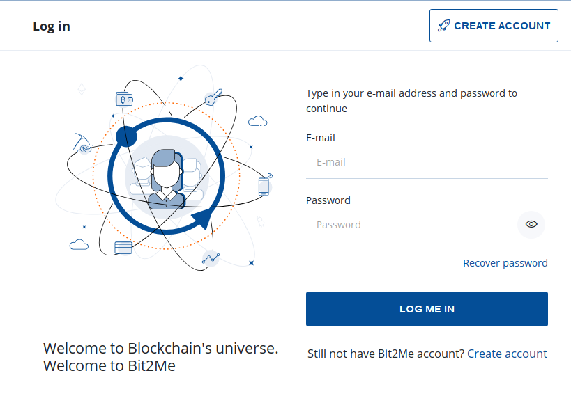
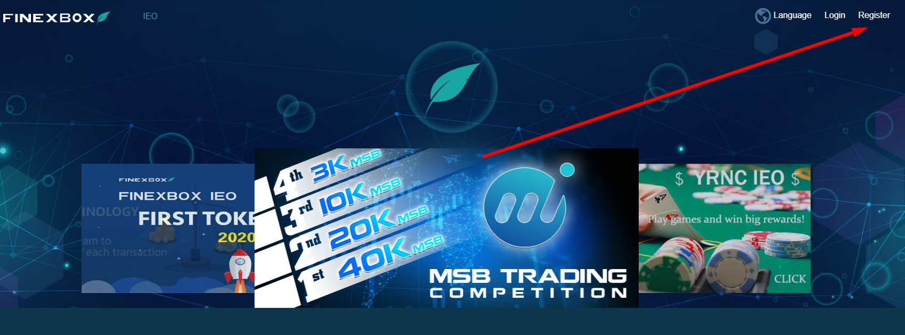
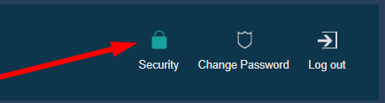
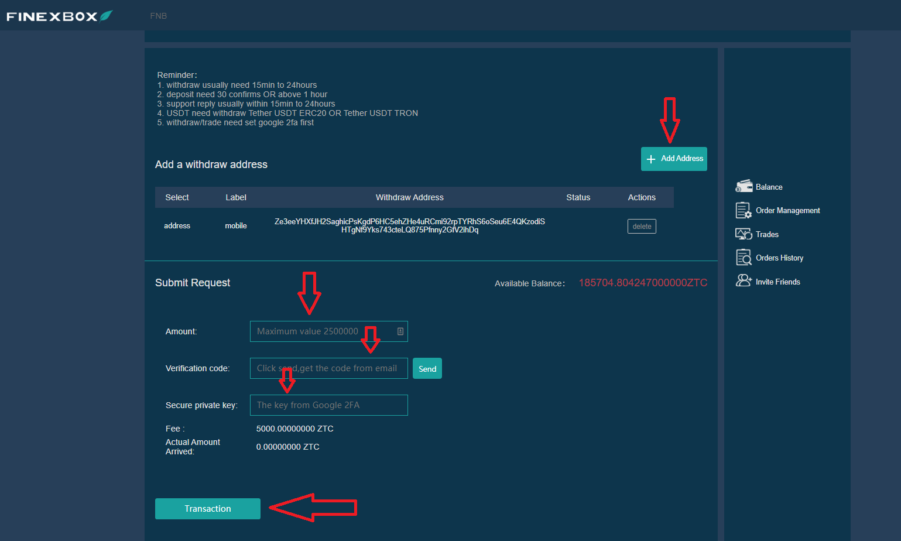

## **Index:**

1. Bit2Me Registration
2. How do I verify my Bit2Me account? Step by Step…
3. Buy Bitcoins
4. Finexbox Registration
5. Transfer your Bitcoins from your Bit2Me Wallet to your Finexbox Wallet
6. Send Bitcoins to your Finexbox Wallet
7. Buy Zents
8. Send my Zents to my own wallet

## 1. Bit2Me Registration

Access to Bit2Me: https://bit2me.com/register?r=AOP-U0D-KIU

All you have to do is go to the Access section or click on this [link](https://bit2me.com/es/registro?r=AOP-U0D-KIU).

[**More**]  https://support.bit2me.com/en/support/home Bit2Me Info

We click on the Register button. Enter your email and password. Accept the terms and conditions that we present to you. Then you just have to click on the Register button.

Once you have registered, enter your email and you will find this Bit2Me message to verify your account. Click on **Confirm** **Email**. If the button doesn't work, copy the attached link to your browser to confirm it. In this easy and simple way you will have your email account verified. (If you haven't received the message yet, click the **Resend Email** button. 

> Remember to check your spam folder as well

When you confirm your account, you can edit your profile, create a username, and link your phone number if you wish.

Congratulations, you are already a Bit2Me user! After registering you are one step closer to cryptocurrencies. If you want to give the following click on the button below to start with the creation of your wallet in [Bit2Me Wallet](https://wallet.bit2me.com/). CREATE PURSE NOW!

## 2. How do I verify my Bit2Me account? Step by Step…

In order to buy and sell on Bit2Me you need to verify the account. To do this, we first have to fill in our data (name, surname, identity number, nationality, date of birth ...)

1. We open the Bit2Me page, and click on **ACCESS** (at the top)

   

2. We connect with our email and password.

   

   

3. Once the **GENERAL** profile (email, user and phone) is completed, we go to the **IDENTITY** part to complete the verification.

   

4. **Verification is done in 3 steps:** INFORMATION, IDENTITY AND UPLOAD PHOTOS To take the photos correctly, you can follow our guide here: [How should you take registration photos?](https://support.bit2me.com/en/support/solutions/articles/35000051157-how-should-you-take-the-registration-photos-)

5. Once all the data has been filled in, our Verification Department will be in charge of making the verification and accepting or denying indicating the reason (Article: Why has my verification been denied?)

> Youtube (Spanish): [👩â€ðŸ« TUTORIAL como COMPRAR BITCOIN fácil con TARJETA de deÌbito en Bit2Me](https://www.youtube.com/watch?v=u2yXd0pTr5k) 

## 3. Buy Bitcoins

Now you can get Bitcoins by Credit card, bank transfer and other payment system´s.

Do Click on Buy button and select:

- What do you want to buy? --> Bitcoin (BTC)
- How much do you want to pay? --> Select how much you want to buy
- Where do you want to receive them? --> you can select your Bitcoin wallet or add more wallets
- Select how do you want to pay

Now we can send our Bitcoins to our Finexbox wallet

## 4. Finexbox Registration

Go to [finexbox.com](https://www.finexbox.com/Reg/register/referrer/371)

 Click on the registration button

Enter your Gmail email if possible, and a password twice

`(Password length between 6-20 english characters or number)`

*If you want, you can add Referral ID: **371***

Finexbox implements a two-step security system to prevent cryptocurrency theft, so that even if they find out your password, they will not be able to enter without the code that is generated every 30 seconds on your cell phone.

For example, we can use the [**Google Authenticator**](https://play.google.com/store/apps/details?id=com.google.android.apps.authenticator2&hl=es&gl=US), or for Apple with [Authenticato‪r](https://apps.apple.com/es/app/authenticator/id766157276).

## 5. Transfer your Bitcoins from your Bit2Me Wallet to your Finexbox Wallet

- Go to the balance section and look for the Bitcoin/BTC symbol.
- Click on the button on the right that indicates **deposit**.

Finexbox will create a Bitcoin Wallet unique to you

Copy your Wallet address

## 6. Send Bitcoins to your Finexbox Wallet

Open your Bit2Me wallet

### Accept all security warnings

 

Bit2Me will send you a message to your phone, with the security code.

> :warning: The transfer is **not instantaneous**, it can take up to 30-45 minutes.

## 7. Buy Zents

- Back to the Finexbox main screen
- First, configure the second authentication factor by clicking on the Security button in your user panel, this is a one-time operation.

Once the configuration is complete, we can continue.

- Check if your bitcoins have arrived

- When they have arrived, click on the Finexbox logo, in the upper left corner
- You will see all the currencies that can be exchanged, and above them a light blue bar on which the BTC tab is marked.
- To the right of it you can type to search for currencies

> :warning: ​if you are accessing from a smartphone, you will have to set it **horizontally**. 

- Type ZTC and you will only see the pair we are interested in ZentCash (ZTC/BTC)

- Click on it
- You will enter the BTC for ZTC exchange panel.
  

- Click in the star:
  
- Scroll to the bottom of the panel where you will see both **buy** and **sell orders**.

The **left** column is people who want to **Buy** Zents, the **Right** column is people who want to **Sell** Zents.

You can try to sell Zents and/or buy them at the price you want, if you want to buy or sell immediately, just select the **first order** in each column.

**To buy:**

- Select the first **red column** row on the right.
- The data will appear in the green **Buy** box.
- Click on the **Buy** button

**To sell:**

- Select the first **green column** row on the left.
- The data will appear in the green **Sell** box.
- Click on the **Sell** button

### Can I sell at a certain price?

Of course, If you want to buy at a certain price

- If you wish to set a specific exchange price, enter it in the "Price" field of the "Buy Orders" column and put the quantity you wish to purchase in the "Volume" field.

|  |  |
| ---------------------------------------------- | -------------------------------------------- |
|                                                |                                              |

You can Cancel your orders:

#### 💃💃**Congratulations, you already have your Zents!** 💃💃

## 8. Send my Zents to my own wallet

We recommend storing Zents in personal wallets, for this you have the [Zent Wallet on Web](https://wallet.zent.cash/) and [mobile App](https://play.google.com/store/apps/details?id=cash.zent.mobileapp&hl=es&gl=US), for now it is only for Android. 

- https://play.google.com/store/apps/details?id=cash.zent.mobileapp&hl=es&gl=US 
- https://wallet.zent.cash/

Click on your email in the top right corner, it will take you to your user panel.

Click on Hide zero balances: 

In Zent row press **Withdraw** Button:

**Your own Zent Wallet**

To withdraw your Zent Cash, you need your own wallet outside of Finexbox Exchanger, you can use the mobile application, the web wallet or Zent Binary to generate your own wallet.

Copy your Address from Mobile App, Web Wallet or Zent binary.

Click on **+Add Address** button and paste your wallet address

- Then select the Zents you want to send (**2.5 million maximum**)
- Click on **Send Button →** It will send to your email a 4 digit code, when it arrives write it down in the field to the left of the Send button.
- Finally, open the Authenticator application and copy the numbers that are randomly generated every X seconds, in the field The key from Google 2FA
- Press the **transaction** button

Your order will appear in Withdraw History as pending.

> :warning:It may take up to 24 hours to execute. 
>

> 🚧
> **For security reasons, you may not see the "Completed" message when you make the transaction, but a message indicating that, if in 5 minutes it does not appear in the history, you have to send an email to Finexbox support, in this case, send them an email to reactivate the Withdrawal. **
> 🚧
