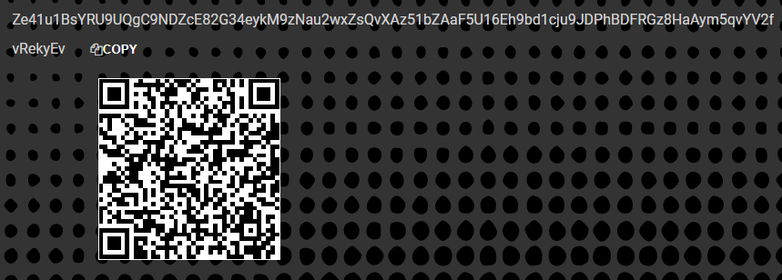

## **Index:**

1.  Enregistrement Bit2Me
2.  Comment puis-je vérifier mon compte Bit2Me ? Étape par étape...
3.  Acheter des Bitcoins
4.  Inscription Finexbox
5.  Transférez vos Bitcoins de votre portefeuille Bit2Me à votre portefeuille Finexbox
6.  Envoyez des Bitcoins à votre portefeuille Finexbox
7.  Acheter Zents
8.  Envoyez mes Zents à mon propre portefeuille

## 1. Enregistrement Bit2Me

Accès à Bit2Me: <https://bit2me.com/register?r=AOP-U0D-KIU>

Tout ce que vous avez à faire est d’aller à la section Accès ou cliquez sur ce [Lien](https://bit2me.com/es/registro?r=AOP-U0D-KIU).

[**Plus**]  <https://support.bit2me.com/en/support/home> Bit2Me Info

Nous cliquons sur le bouton Registre. Entrez votre e-mail et mot de passe. Acceptez les modalités que nous vous présentons. Ensuite, il vous suffit de cliquer sur le bouton Enregistrer.

Une fois que vous vous êtes inscrit, entrez votre e-mail et vous trouverez ce message Bit2Me pour vérifier votre compte. Cliquez sur **Confirmer** **Messagerie électronique**. Si le bouton ne fonctionne pas, copiez le lien joint à votre navigateur pour le confirmer. De cette façon simple et simple, vous aurez votre compte de messagerie vérifié. (Si vous n’avez pas encore reçu le message, cliquez sur le **Renvoyer l’e-mail** Bouton. 

> N’oubliez pas de vérifier votre dossier de spam ainsi

Lorsque vous confirmez votre compte, vous pouvez modifier votre profil, créer un nom d’utilisateur et lier votre numéro de téléphone si vous le souhaitez.

Félicitations, vous êtes déjà un utilisateur Bit2Me! Après l’enregistrement, vous êtes un pas de plus vers les crypto-monnaies. Si vous souhaitez donner le clic suivant sur le bouton ci-dessous pour commencer par la création de votre portefeuille en [Portefeuille Bit2Me](https://wallet.bit2me.com/). CRÉEZ SAC À MAIN MAINTENANT!

## 2. Comment puis-je vérifier mon compte Bit2Me ? Étape par étape...

Afin d’acheter et de vendre sur Bit2Me, vous devez vérifier le compte. Pour ce faire, nous devons d’abord remplir nos données (nom, nom de famille, numéro d’identité, nationalité, date de naissance...)

1.  Nous ouvrons la page Bit2Me, et cliquez sur **Accès** (en haut)

    

2.  Nous nous connectons avec notre e-mail et mot de passe.

    

3.  Une fois que le **Généralités** profil (e-mail, utilisateur et téléphone) est complété, nous allons à la **Identité** partie pour compléter la vérification.

    

4.  **La vérification se fait en 3 étapes :** INFORMATIONS, IDENTITÉ ET TÉLÉCHARGER DES PHOTOS Pour prendre correctement les photos, vous pouvez suivre notre guide ici: [Comment devriez-vous prendre des photos d’inscription?](https://support.bit2me.com/en/support/solutions/articles/35000051157-how-should-you-take-the-registration-photos-)

5.  Une fois que toutes les données auront été remplies, notre service de vérification sera chargé de faire la vérification et d’accepter ou de nier indiquant la raison (Article : Pourquoi ma vérification a-t-elle été refusée?)

> Youtube (espagnol): [👩 🫠TUTORIAL como COMPRAR BITCOIN fácil con TARJETA de débito en Bit2Me](https://www.youtube.com/watch?v=u2yXd0pTr5k) 

## 3. Acheter des Bitcoins

Maintenant, vous pouvez obtenir bitcoins par carte de crédit, virement bancaire et d’autres systèmes de paiement.

Cliquez sur Bouton Acheter et sélectionnez :

-   Qu’est-ce que vous voulez acheter? --> Bitcoin (BTC)
-   Combien voulez-vous payer? --> Sélectionnez combien vous voulez acheter
-   Où voulez-vous les recevoir? --> vous pouvez sélectionner votre portefeuille Bitcoin ou ajouter plus de portefeuilles
-   Sélectionnez comment voulez-vous payer

Maintenant, nous pouvons envoyer nos Bitcoins à notre portefeuille Finexbox

## 4. Inscription Finexbox

Atteindre [finexbox.com](https://www.finexbox.com/Reg/register/referrer/371)

 Cliquez sur le bouton d’inscription

Entrez votre e-mail Gmail si possible, et un mot de passe deux fois

`(Password length between 6-20 english characters or number)`

\*Si vous le souhaitez, vous pouvez ajouter l’ID de référence : **371\***

Finexbox implémente un système de sécurité en deux étapes pour prévenir le vol de crypto-monnaie, de sorte que même s’ils trouvent votre mot de passe, ils ne seront pas en mesure d’entrer sans le code qui est généré toutes les 30 secondes sur votre téléphone cellulaire.

Par exemple, nous pouvons utiliser le [**Authentification Google**](https://play.google.com/store/apps/details?id=com.google.android.apps.authenticator2&hl=es&gl=US), ou pour Apple avec [Authenticato‪r](https://apps.apple.com/es/app/authenticator/id766157276).

## 5. Transférez vos Bitcoins de votre portefeuille Bit2Me à votre portefeuille Finexbox

-   Allez à la section équilibre et recherchez le symbole Bitcoin/BTC.
-   Cliquez sur le bouton sur la droite qui indique **Dépôt**.

Finexbox créera un portefeuille Bitcoin unique à vous

Copiez votre adresse Portefeuille

## 6. Envoyez des Bitcoins à votre portefeuille Finexbox

Ouvrez votre portefeuille Bit2Me

### Accepter tous les avertissements de sécurité

 

Bit2Me vous enverra un message à votre téléphone, avec le code de sécurité.

> :avertissement: Le transfert est **pas instantané**, cela peut prendre jusqu’à 30-45 minutes.

## 7. Acheter Zents

-   Retour à l’écran principal finexbox
-   Tout d’abord, configurer le deuxième facteur d’authentification en cliquant sur le bouton Sécurité dans votre panneau utilisateur, il s’agit d’une opération une fois.

Une fois la configuration terminée, nous pouvons continuer.

-   Vérifiez si vos bitcoins sont arrivés

-   Quand ils sont arrivés, cliquez sur le logo Finexbox, dans le coin supérieur gauche
-   Vous verrez toutes les devises qui peuvent être échangées, et au-dessus d’eux une barre bleu clair sur laquelle l’onglet BTC est marqué.
-   À droite de celui-ci, vous pouvez taper pour rechercher des devises

> :attention: si vous accédez à partir d’un smartphone, vous devrez le régler **Horizontalement**. 

-   Tapez ZTC et vous ne verrez que la paire qui nous intéresse à ZentCash (ZTC/BTC)

-   Cliquez dessus

-   Vous entrez le BTC pour le panneau d’échange ZTC.

-   Cliquez dans l’étoile:
    
-   Faites défiler vers le bas du panneau où vous verrez les deux **Acheter** Et **vendre des commandes**.

Lla **Gauche** colonne est les gens qui veulent **Acheter** Zents, le **Droite** colonne est les gens qui veulent **Vendre** Des Zents.

Vous pouvez essayer de vendre zents et / ou les acheter au prix que vous voulez, si vous voulez acheter ou vendre immédiatement, il suffit de sélectionner le **première commande** dans chaque colonne.

**Pour acheter :**

-   Sélectionnez le premier **colonne rouge** rangée sur la droite.
-   Les données apparaîtront dans le vert **Acheter** Boîte.
-   Cliquez sur le **Acheter** Bouton

**Pour vendre :**

-   Sélectionnez le premier **colonne verte** rangée sur la gauche.
-   Les données apparaîtront dans le vert **Vendre** Boîte.
-   Cliquez sur le **Vendre** Bouton

### Puis-je vendre à un certain prix?

Bien sûr, si vous voulez acheter à un certain prix

-   Si vous souhaitez définir un prix de change spécifique, entrez-le dans le champ « Prix » de la colonne « Ordres d’achat » et mettez la quantité que vous souhaitez acheter dans le champ « Volume ».

|  |  |
| ---------------------------------------------- | -------------------------------------------- |
|                                                |                                              |

Vous pouvez annuler vos commandes :

#### 💃💃**Félicitations, vous avez déjà vos Zents!** 💃💃

## 8. Envoyez mes Zents à mon propre portefeuille

Nous vous recommandons de stocker zents dans des portefeuilles personnels, pour cela vous avez le [Zent Wallet sur le Web](https://wallet.zent.cash/) Et [application mobile](https://play.google.com/store/apps/details?id=cash.zent.mobileapp&hl=es&gl=US), pour l’instant, il est seulement pour Android. 

-   <https://play.google.com/store/apps/details?id=cash.zent.mobileapp&hl=es&gl=US> 
-   <https://wallet.zent.cash/>

Cliquez sur votre e-mail dans le coin supérieur droit, il vous emmènera à votre panneau utilisateur.

Cliquez sur Masquer les soldes zéro : 

Dans la presse de ligne zent **Retirer** Bouton:

**Votre propre portefeuille Zent**

Pour retirer votre Zent Cash, vous avez besoin de votre propre portefeuille en dehors de Finexbox Exchanger, vous pouvez utiliser l’application mobile, le portefeuille Web ou Zent Binary pour générer votre propre portefeuille.

Copiez votre adresse à partir de Mobile App, Web Wallet ou Zent binary.

Cliquez sur **+Ajouter l’adresse** bouton et coller votre adresse portefeuille

-   Sélectionnez ensuite les Zents que vous souhaitez envoyer (**2,5 millions maximum**)
-   Cliquez sur **Envoyer button →** Il enverra à votre e-mail un code à 4 chiffres, quand il arrive l’écrire dans le champ à gauche du bouton Envoyer.
-   Enfin, ouvrez l’application Authenticator et copiez les numéros générés au hasard toutes les X secondes, sur le terrain La clé de Google 2FA
-   Appuyez sur le **Transaction** Bouton

Votre commande apparaîtra dans Retirer l’histoire comme en attente.

> :avertissement : L’exécution peut prendre jusqu’à 24 heures. 

> 🚧
> **Pour des raisons de sécurité, vous ne pouvez pas voir le message « Terminé » lorsque vous faites la transaction, mais un message indiquant que, si en 5 minutes il n’apparaît pas dans l’historique, vous devez envoyer un e-mail à la prise en charge Finexbox, dans ce cas, leur envoyer un e-mail pour réactiver le retrait. **
> 🚧
