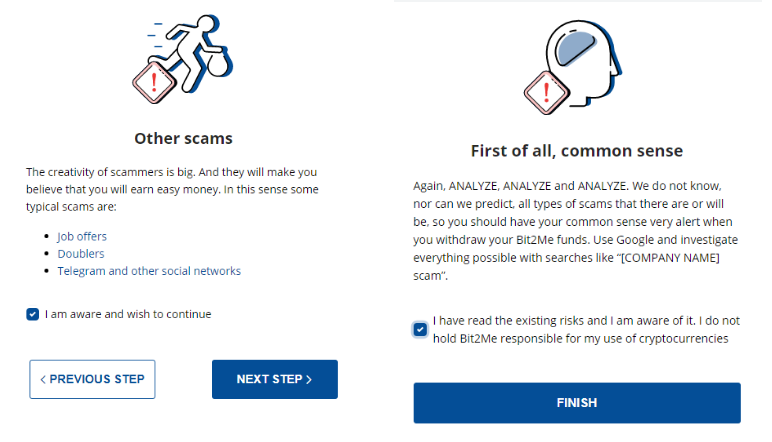
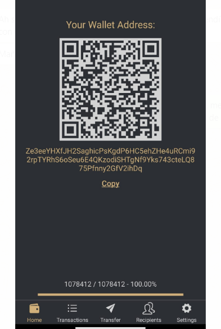

## **Indice:**

1.  Registrazione Bit2Me
2.  Come posso verificare il mio account Bit2Me? Passo dopo passo...
3.  Acquista Bitcoin
4.  Registrazione Finexbox
5.  Trasferisci i tuoi Bitcoin dal tuo portafoglio Bit2Me al tuo portafoglio Finexbox
6.  Invia Bitcoin al tuo portafoglio Finexbox
7.  Acquista Zents
8.  Invia i miei Zents al mio portafoglio

## 1. Registrazione Bit2Me

Accesso a Bit2Me: <https://bit2me.com/register?r=AOP-U0D-KIU>

Tutto quello che devi fare è andare alla sezione Access o fare clic su questo [Link](https://bit2me.com/es/registro?r=AOP-U0D-KIU).

[**Più**]  <https://support.bit2me.com/en/support/home> Informazioni su Bit2Me

Clicamo sul pulsante Registra. Immettere la posta elettronica e la password. Accetta i termini e le condizioni che ti presentiamo. Quindi devi solo fare clic sul pulsante Registra.

Una volta che ti sei registrato, inserisci la tua e-mail e troverai questo messaggio Bit2Me per verificare il tuo account. Clicca su **Confermare** **E-mail**. Se il pulsante non funziona, copia il link allegato al browser per confermarlo. In questo modo semplice e semplice avrai verificato il tuo account e-mail. Se il messaggio non è ancora stato ricevuto, fare clic sul pulsante **Invia di nuovo posta elettronica** Pulsante. 

> Ricorda di controllare anche la tua cartella spam

Quando confermi il tuo account, puoi modificare il tuo profilo, creare un nome utente e collegare il tuo numero di telefono, se lo desideri.

Congratulazioni, sei già un utente Bit2Me! Dopo la registrazione sei un passo più vicino alle criptovalute. Se vuoi dare il seguente clic sul pulsante qui sotto per iniziare con la creazione del tuo portafoglio in [Portafoglio Bit2Me](https://wallet.bit2me.com/). CREA SUBITO LA BORSA!

## 2. Come posso verificare il mio account Bit2Me? Passo dopo passo...

Per acquistare e vendere su Bit2Me è necessario verificare l'account. Per fare questo, dobbiamo prima compilare i nostri dati (nome, cognome, numero di identità, nazionalità, data di nascita ...)

1.  Apriamo la pagina Bit2Me e clicamo su **Accesso** (in alto)

    

2.  Ci connettiamo con la nostra e-mail e password.

    

3.  Una volta **Generale** profilo (e-mail, utente e telefono) è completato, andiamo al **Identità** parte per completare la verifica.

    

4.  **La verifica viene eseguita in 3 passaggi:** INFORMAZIONI, IDENTITÀ E CARICARE FOTO Per scattare correttamente le foto, puoi seguire la nostra guida qui: [Come dovresti scattare foto di registrazione?](https://support.bit2me.com/en/support/solutions/articles/35000051157-how-should-you-take-the-registration-photos-)

5.  Una volta compilati tutti i dati, il nostro Dipartimento verifica avrà il responsabilità di effettuare la verifica e accettare o negare indicando il motivo (Articolo: Perché la mia verifica è stata negata?)

> Youtube (spagnolo): [👩 🫠TUTORIAL como COMPRAR BITCOIN fácil con TARJETA de débito en Bit2Me](https://www.youtube.com/watch?v=u2yXd0pTr5k) 

## 3. Acquista Bitcoin

Ora puoi ottenere Bitcoin con carta di credito, bonifico bancario e altri sistemi di pagamento.

Fare clic sul pulsante Acquista e selezionare:

-   Cosa vuoi comprare? --> Bitcoin (BTC)
-   Quanto vuoi pagare? --> Selezionare quanto si desidera acquistare
-   Dove vuoi riceverli? --> puoi selezionare il tuo portafoglio Bitcoin o aggiungere più portafogli
-   Seleziona come vuoi pagare

Ora possiamo inviare i nostri Bitcoin al nostro portafoglio Finexbox

## 4. Registrazione Finexbox

Vai a [finexbox.com](https://www.finexbox.com/Reg/register/referrer/371)

 Clicca sul pulsante di registrazione

Inserisci la tua e-mail Gmail, se possibile, e una password due volte

`(Password length between 6-20 english characters or number)`

\*Se lo desideri, puoi aggiungere l'ID di riferimento: **371\***

Finexbox implementa un sistema di sicurezza in due fase per prevenire il furto di criptovalute, in modo che anche se svengono a scoprire la tua password, non saranno in grado di entrare senza il codice generato ogni 30 secondi sul tuo cellulare.

Ad esempio, possiamo usare il [**Autenticatore di Google**](https://play.google.com/store/apps/details?id=com.google.android.apps.authenticator2&hl=es&gl=US), o per Apple con [Authenticato‪r](https://apps.apple.com/es/app/authenticator/id766157276).

## 5. Trasferisci i tuoi Bitcoin dal tuo portafoglio Bit2Me al tuo portafoglio Finexbox

-   Vai alla sezione saldo e cerca il simbolo Bitcoin / BTC.
-   Clicca sul pulsante a destra che indica **Deposito**.

Finexbox creerà un Portafoglio Bitcoin unico per te

Copiare l'indirizzo del portafoglio

## 6. Invia Bitcoin al tuo portafoglio Finexbox

Aprire il portafoglio Bit2Me

### Accettare tutti gli avvisi di sicurezza

 

Bit2Me ti invierà un messaggio al tuo telefono, con il codice di sicurezza.

> :attenzione: il trasferimento è **non istantaneo**, possono essere necessario fino a 30-45 minuti.

## 7. Acquista Zents

-   Torna alla schermata principale di Finexbox
-   Innanzitutto, configura il secondo fattore di autenticazione facendo clic sul pulsante Sicurezza nel pannello utente, questa è un'operazione una sola volta.

Una volta completata la configurazione, possiamo continuare.

-   Controlla se i tuoi bitcoin sono arrivati

-   Una volta arrivati, clicca sul logo Finexbox, nell'angolo in alto a sinistra
-   Vedrai tutte le valute che possono essere scambiate e sopra di esse una barra azzurra su cui è contrassegnata la scheda BTC.
-   A destra di esso è possibile digitare per cercare valute

> :attenzione: se si accede da uno smartphone, sarà necessario impostarlo **Orizzontalmente**. 

-   Digitare ZTC e vedrai solo la coppia che ci interessa ZentCash (ZTC / BTC)

-   Clicca su di esso

-   Si entrerà nel pannello di scambio BTC per ZTC.

-   Clicca nella stella:
    
-   Scorri fino alla parte inferiore del pannello dove vedrai entrambi **Acquistare** E **vendere ordini**.

Le **A sinistra** colonna sono le persone che vogliono **Acquistare** Zents, il **A destra** colonna sono le persone che vogliono **Vendere** Zents.

Puoi provare a vendere Zents e/o acquistarli al prezzo che desideri, se vuoi acquistare o vendere immediatamente, basta selezionare il **primo ordine** in ogni colonna.

**acquistare:**

-   Selezionare il primo **colonna rossa** fila a destra.
-   I dati appariranno in verde **Acquistare** Casella.
-   Clicca sul **Acquistare** Pulsante

**Vendere:**

-   Selezionare il primo **colonna verde** fila a sinistra.
-   I dati appariranno in verde **Vendere** Casella.
-   Clicca sul **Vendere** Pulsante

### Posso vendere ad un certo prezzo?

Naturalmente, Se si desidera acquistare ad un certo prezzo

-   Se si desidera impostare un prezzo di cambio specifico, immetterlo nel campo "Prezzo" della colonna "Acquista ordini" e inserire la quantità che si desidera acquistare nel campo "Volume".

|  |  |
| ---------------------------------------------- | -------------------------------------------- |
|                                                |                                              |

Puoi annullare i tuoi ordini:

#### 💃💃**Congratulazioni, hai già i tuoi Zents!** 💃💃

## 8. Invia i miei Zents al mio portafoglio

Si consiglia di memorizzare Zents in portafogli personali, per questo si ha il [Portafoglio Zent sul Web](https://wallet.zent.cash/) E [App mobile](https://play.google.com/store/apps/details?id=cash.zent.mobileapp&hl=es&gl=US), per ora è solo per Android. 

-   <https://play.google.com/store/apps/details?id=cash.zent.mobileapp&hl=es&gl=US> 
-   <https://wallet.zent.cash/>

Fai clic sulla tua e-mail nell'angolo in alto a destra, ti porterà al tuo pannello utente.

Clicca su Nascondi saldi zero: 

Nella riga Zent premere **Ritirare** Pulsante:

**Il tuo portafoglio Zent**

Per prelevare il tuo Zent Cash, hai bisogno del tuo portafoglio al di fuori di Finexbox Exchanger, puoi utilizzare l'applicazione mobile, il portafoglio web o Zent Binary per generare il tuo portafoglio.

Copia il tuo indirizzo da Mobile App, Web Wallet o Zent binary.

Clicca su **+Aggiungi indirizzo** e incollare l'indirizzo del portafoglio

-   Quindi seleziona gli Zents che vuoi inviare (**Massimo 2,5 milioni**)
-   Clicca su **Invia pulsante →** Invierà alla tua e-mail un codice di 4 cifre, quando arriverà scriverlo nel campo a sinistra del pulsante Invia.
-   Infine, apri l'applicazione Authenticator e copia i numeri generati casualmente ogni X secondi, nel campo La chiave di Google 2FA
-   Premere il tasto **Transazione** Pulsante

Il tuo ordine apparirà in Ritiro cronologia come in sospeso.

> :avviso:l'esecuzione potrebbe richiedere fino a 24 ore. 

> 🚧
> **Per motivi di sicurezza, potresti non vedere il messaggio "Completato" quando fai la transazione, ma un messaggio che indica che, se in 5 minuti non appare nella cronologia, devi inviare un'e-mail al supporto di Finexbox, in questo caso, inviare loro un'e-mail per riattivare il prelievo. **
> 🚧
