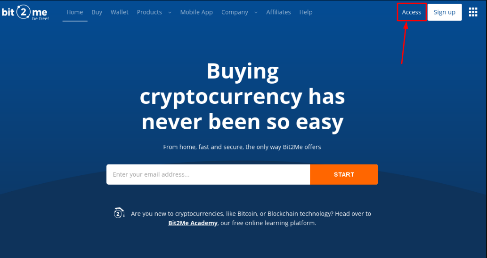
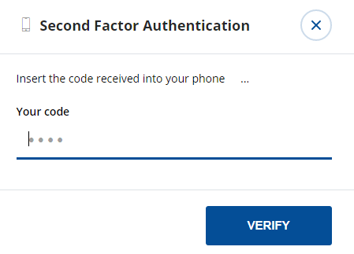

## **인덱스:**

1.  비트2Me 등록
2.  Bit2Me 계정을 확인하려면 어떻게 해야 하나요? 단계별로...
3.  비트코인 구매
4.  파인박스 등록
5.  비트2Me 지갑에서 파인박스 지갑으로 비트코인 전송
6.  파인엑스 지갑에 비트코인 보내기
7.  젠트 구매
8.  내 젠츠를 내 지갑에 보내기

## 1. Bit2Me 등록

Bit2Me에 대한 액세스: <https://bit2me.com/register?r=AOP-U0D-KIU>

액세스 섹션으로 이동하거나 이 섹션을 클릭하기만 하면 됩니다. [링크](https://bit2me.com/es/registro?r=AOP-U0D-KIU).

[**더**]  <https://support.bit2me.com/en/support/home> Bit2Me 정보

레지스터 버튼을 클릭합니다. 이메일과 비밀번호를 입력합니다. 당사가 귀하에게 제시하는 이용 약관을 수락합니다. 그런 다음 레지스터 버튼을 클릭하기만 하면 됩니다.

등록한 후 이메일을 입력하면 계정을 확인하기 위해 이 Bit2Me 메시지를 찾을 수 있습니다. 클릭 **확인** **이메일**. 버튼이 작동하지 않으면 연결된 링크를 브라우저에 복사하여 확인합니다. 이 쉽고 간단한 방법으로 당신은 당신의 이메일 계정을 확인해야합니다. 메시지를 아직 받지 못한 경우 **이메일 다시 보내기** 단추. 

> 스팸 폴더도 확인해야 합니다.

계정을 확인하면 프로필을 편집하고, 사용자 이름을 만들고, 원하는 경우 전화 번호를 연결할 수 있습니다.

축하합니다, 당신은 이미 Bit2Me 사용자입니다! 등록 후 당신은 암호 화폐에 한 걸음 더 가까이 있습니다. 지갑 을 만드는 것부터 시작하기 위해 아래 버튼을 클릭하려면 다음 버튼을 클릭하십시오. [비트2Me 지갑](https://wallet.bit2me.com/). 지금 지갑을 만들!

## 2. Bit2Me 계정은 어떻게 확인하나요? 단계별로...

Bit2Me에서 사고 팔기 위해서는 계정을 확인해야 합니다. 이렇게하려면 먼저 데이터 (이름, 성, 신원 번호, 국적, 생년월일 ...)

1.  Bit2Me 페이지를 열고 클릭합니다. **액세스** (맨 위에)

    

2.  우리는 우리의 이메일과 암호에 연결합니다.

    

3.  일단 **일반** 프로필(이메일, 사용자 및 전화)이 완료되고, **Id** 확인을 완료하기 위한 부품입니다.

    

4.  **검증은 3단계로 수행됩니다.** 정보, 신원 및 업로드 사진 올바르게 사진을 찍려면 여기에서 가이드를 따를 수 있습니다. [등록 사진은 어떻게 해야 하나요?](https://support.bit2me.com/en/support/solutions/articles/35000051157-how-should-you-take-the-registration-photos-)

5.  모든 데이터가 채워지면 당사의 검증 부서는 확인을 하고 이유를 나타내는 확인을 수락하거나 부인하는 일을 담당하게 됩니다(기사: 확인이 거부된 이유는 무엇입니까?)

> 유튜브 (스페인어): [👩 🏫 튜토리얼 코모 COMPRAR 비트 코인 fácil 콘 TARJETA 드 데비토 en Bit2Me](https://www.youtube.com/watch?v=u2yXd0pTr5k) 

## 3. 비트코인 구매

이제 신용 카드, 은행 송금 및 기타 결제 시스템으로 비트코인을 얻을 수 있습니다.

구매 버튼을 클릭하고 다음을 선택하십시오.

-   무엇을 사고 싶으신가요? --> 비트코인 (BTC)
-   얼마를 지불하시겠습니까? --> 얼마나 구입하려는지 선택하십시오.
-   어디에서 받고 싶으신가요? -> 비트코인 지갑을 선택하거나 지갑을 더 추가할 수 있습니다.
-   결제 방법 선택

이제 우리는 우리의 파인 박스 지갑에 우리의 비트 코인을 보낼 수 있습니다

## 4. 파인박스 등록

로 가다 [finexbox.com](https://www.finexbox.com/Reg/register/referrer/371)

 등록 버튼을 클릭합니다.

가능하면 Gmail 이메일과 비밀번호를 두 번 입력합니다.

`(Password length between 6-20 english characters or number)`

\*원하는 경우 추천 ID를 추가할 수 있습니다. **371\***

Finexbox는 암호 화폐 도난을 방지하기 위해 2 단계 보안 시스템을 구현하여 암호를 발견하더라도 휴대 전화에서 30 초마다 생성되는 코드없이 입력 할 수 없습니다.

예를 들어, [**구글 인증자**](https://play.google.com/store/apps/details?id=com.google.android.apps.authenticator2&hl=es&gl=US)또는 애플과 [Authenticato‪r](https://apps.apple.com/es/app/authenticator/id766157276).

## 5. 비트 2Me 지갑에서 파인 박스 지갑으로 비트 코인을 전송

-   밸런스 섹션으로 이동하여 비트코인/BTC 기호를 찾습니다.
-   오른쪽 의 버튼을 클릭합니다. **예금**.

파인박스는 당신에게 독특한 비트 코인 지갑을 만들 것입니다

지갑 주소 복사

## 6. 파인박스 지갑에 비트코인 보내기

Bit2Me 지갑 열기

### 모든 보안 경고 수락

 

Bit2Me는 보안 코드와 함께 휴대 전화로 메시지를 보냅니다.

> :경고: 전송은 **즉각적인 것이 아닙니다.**최대 30~45분이 소요될 수 있습니다.

## 7. 젠트 구매

-   파인박스 메인 화면으로 돌아가기
-   먼저 사용자 패널의 보안 단추를 클릭하여 두 번째 인증 계수를 구성하면 일회성 작업입니다.

구성이 완료되면 계속할 수 있습니다.

-   비트코인이 도착했는지 확인

-   도착한 경우 왼쪽 상단 모서리에 있는 Finexbox 로고를 클릭합니다.
-   교환할 수 있는 모든 통화를 볼 수 있으며, 그 위에는 BTC 탭이 표시된 밝은 파란색 막대가 표시됩니다.
-   그것의 오른쪽에 당신은 통화를 검색입력 할 수 있습니다

> :경고 : 스마트 폰에서 액세스하는 경우, 당신은 그것을 설정해야합니다 **가로로**. 

-   유형 ZTC 당신은 우리가 ZentCash (ZTC / BTC)에 관심이쌍을 볼 수 있습니다

-   클릭하기

-   ZTC 교환 패널에 대한 BTC를 입력합니다.

-   별표를 클릭합니다.
    
-   패널 하단으로 스크롤하여 둘 다 표시됩니다. **구입** 및 **주문 판매**.

Tthe **왼쪽** 칼럼은 원하는 사람입니다. **구입** 젠트, **오른쪽** 칼럼은 원하는 사람입니다. **판매** 젠트.

Zents를 판매하거나 원하는 가격으로 구입하려고 시도할 수 있습니다. **첫 번째 주문** 각 열에서.

**구입하려면:**

-   첫 번째 선택 **빨간색 열** 오른쪽에 있는 행입니다.
-   데이터가 녹색에 나타납니다. **구입** 상자.
-    **구입** 단추

**판매하려면:**

-   첫 번째 선택 **녹색 열** 왼쪽에 있는 행입니다.
-   데이터가 녹색에 나타납니다. **판매** 상자.
-    **판매** 단추

### 특정 가격으로 판매할 수 있나요?

물론, 특정 가격으로 사고 싶은 경우

-   특정 교환 가격을 설정하려면 "주문 구매" 열의 "가격" 필드에 입력하고 구매하려는 수량을 "볼륨" 필드에 넣습니다.

|  |  |
| ---------------------------------------------- | -------------------------------------------- |
|                                                |                                              |

주문을 취소할 수 있습니다.

#### 💃💃**축하합니다, 당신은 이미 당신의 Zents가있습니다!** 💃💃

## 8. 내 젠츠를 내 지갑에 보내

젠트를 개인 지갑에 보관하는 것이 좋습니다. [웹에 젠트 지갑](https://wallet.zent.cash/) 및 [모바일 앱](https://play.google.com/store/apps/details?id=cash.zent.mobileapp&hl=es&gl=US)- 지금은 안드로이드에 대한 것입니다. 

-   <https://play.google.com/store/apps/details?id=cash.zent.mobileapp&hl=es&gl=US> 
-   <https://wallet.zent.cash/>

오른쪽 상단 모서리에 있는 이메일을 클릭하면 사용자 패널로 이동합니다.

0 잔액 숨기기:를 클릭합니다. 

젠트 행 프레스 **철회** 단추:

**자신의 젠트 지갑**

Zent Cash를 인출하려면 Finexbox Exchanger 외부에서 자신의 지갑이 필요하며 모바일 응용 프로그램, 웹 지갑 또는 Zent Binary을 사용하여 지갑을 생성할 수 있습니다.

모바일 앱, 웹 지갑 또는 젠트 바이너리에서 주소를 복사합니다.

클릭 **+주소 추가** 지갑 주소를 버튼과 붙여 넣기

-   그런 다음 보낼 젠츠를 선택합니다.**최대 250만 명**)
-   클릭 **버튼 → 보내기** 그것은 당신의 이메일에 보내집니다 4 자리 코드, 그것은 도착 하면 보내기 버튼의 왼쪽에 필드에 적어.
-   마지막으로 인증자 응용 프로그램을 열고 X 초마다 무작위로 생성되는 숫자를 복사합니다.
-   누를 수 있습니다. **트랜잭션** 단추

주문은 보류 중인 것으로 인출 기록에 표시됩니다.

> :경고: 실행하는 데 최대 24시간이 걸릴 수 있습니다. 

> 🚧
> **보안상의 이유로 트랜잭션을 만들 때 "완료됨" 메시지가 표시되지 않을 수 있지만, 5분 안에 기록에 나타나지 않으면 Finexbox 지원팀에 이메일을 보내야 합니다. **
> 🚧
