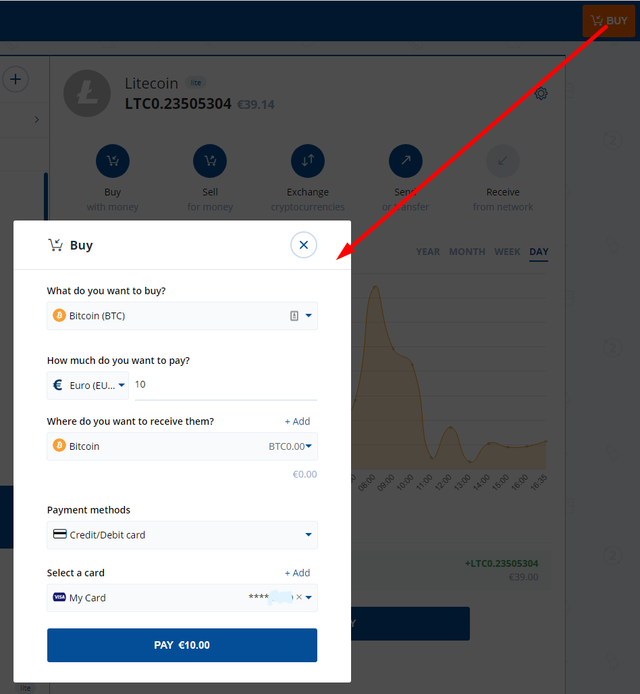

## **Индекс:**

1.  Регистрация Bit2Me
2.  Как проверить свою учетную запись Bit2Me? Шаг за шагом...
3.  Купить биткоины
4.  Регистрация Finexbox
5.  Перенесите свои биткоины с кошелька Bit2Me на кошелек Finexbox
6.  Отправить Bitcoins на ваш кошелек Finexbox
7.  Купить Зентс
8.  Отправить мои Зентс на мой собственный кошелек

## 1. Регистрация Bit2Me

Доступ к Bit2Me: <https://bit2me.com/register?r=AOP-U0D-KIU>

Все, что вам нужно сделать, это перейти к разделу Доступ или нажмите на это [Ссылку](https://bit2me.com/es/registro?r=AOP-U0D-KIU).

[**Больше**]  <https://support.bit2me.com/en/support/home> Bit2Me Информация

Нажмите на кнопку Регистра. Введите свою электронную почту и пароль. Примите условия, которые мы представляем вам. Тогда вам просто нужно нажать на кнопку Регистра.

После регистрации введите электронную почту и найдете это сообщение Bit2Me для проверки вашей учетной записи. Нажмите на **Подтвердить** **Электронная почта**. Если кнопка не работает, скопировать прилагаемую ссылку на браузер, чтобы подтвердить это. Таким простым и простым способом вы будете иметь свой почтовый ящик проверены. (Если вы еще не получили сообщение, нажмите на **Электронная почта Resend** Кнопку. 

> Не забудьте проверить папку спама, а также

Когда вы подтверждаете свою учетную запись, вы можете редактировать свой профиль, создавать имя пользователя и при желании связывать свой номер телефона.

Поздравляем, вы уже bit2Me пользователь! После регистрации вы на шаг ближе к криптовалютам. Если вы хотите дать следующее нажатие на кнопку ниже, чтобы начать с создания вашего кошелька в [Bit2Me Кошелек](https://wallet.bit2me.com/). СОЗДАЙТЕ КОШЕЛЕК ПРЯМО СЕЙЧАС!

## 2. Как проверить свою учетную запись Bit2Me? Шаг за шагом...

Для того, чтобы купить и продать на Bit2Me вам нужно проверить счет. Для этого мы сначала должны заполнить наши данные (имя, фамилия, номер личности, национальность, дата рождения ...)

1.  Мы открываем страницу Bit2Me и нажимаем на **Доступа** (вверху)

    

2.  Мы соединяемся с нашей электронной почтой и паролем.

    

3.  После того, как **Общее** профиль (электронная почта, пользователь и телефон) завершена, мы идем к **Идентичности** часть для завершения проверки.

    

4.  **Проверка проводится в 3 этапа:** ИНФОРМАЦИЯ, IDENTITY И UPLOAD ФОТО Чтобы сделать фотографии правильно, вы можете следовать нашему руководству здесь: [Как сделать регистрационные фотографии?](https://support.bit2me.com/en/support/solutions/articles/35000051157-how-should-you-take-the-registration-photos-)

5.  Как только все данные будут заполнены, наш Контрольный департамент будет отвечать за проверку и принятие или отрицание указания причины (статья: Почему моя проверка была отклонена?)

> Youtube (испанский): [👩 🏫 TUTORIAL КОМО КОМПРАР BITCOIN f'cil con TARJETA де де Дебито ан Bit2Me](https://www.youtube.com/watch?v=u2yXd0pTr5k) 

## 3. Купить биткоины

Теперь вы можете получить Биткойны с помощью кредитной карты, банковского перевода и другой платежной системы.

Нажмите кнопку «Купить» и выберите:

-   Что вы хотите купить? --> Биткойн (BTC)
-   Сколько вы хотите заплатить? --> Выберите, сколько вы хотите купить
-   Где вы хотите их получить? --> вы можете выбрать ваш Bitcoin кошелек или добавить больше кошельков
-   Выберите, как вы хотите платить

Теперь мы можем отправить наши Bitcoins на наш кошелек Finexbox

## 4. Регистрация Finexbox

Перейти к [finexbox.com](https://www.finexbox.com/Reg/register/referrer/371)

 Нажмите на кнопку регистрации

Введите электронную почту Gmail, если это возможно, и пароль дважды

`(Password length between 6-20 english characters or number)`

«Если вы хотите, вы можете добавить идентификатор направления: **371\***

Finexbox реализует двухступную систему безопасности для предотвращения кражи криптовалют, так что даже если они обучат ваш пароль, они не смогут войти без кода, который генерируется каждые 30 секунд на вашем мобильном телефоне.

Например, мы можем использовать [**Аутентичный Google**](https://play.google.com/store/apps/details?id=com.google.android.apps.authenticator2&hl=es&gl=US), или для Apple с [Authenticato‪r](https://apps.apple.com/es/app/authenticator/id766157276).

## 5. Перенесите свои биткоины с вашего кошелька Bit2Me на ваш кошелек Finexbox

-   Перейдите в раздел баланса и ищите символ Bitcoin/BTC.
-   Нажмите на кнопку справа, что указывает на **Депозит**.

Finexbox создаст уникальный для вас Bitcoin Wallet

Копировать адрес кошелька

## 6. Отправить Биткойны на ваш кошелек Finexbox

Откройте свой кошелек Bit2Me

### Примите все предупреждения безопасности

 

Bit2Me отправит вам сообщение на ваш телефон с кодом безопасности.

> :warning: Передача **не мгновенно**, это может занять до 30-45 минут.

## 7. Купить Зентс

-   Вернуться к главному экрану Finexbox
-   Во-первых, настроить второй фактор аутентификации, нажав на кнопку безопасности в панели пользователей, это односемейная операция.

Как только конфигурация будет завершена, мы можем продолжить.

-   Проверьте, прибыли ли ваши биткоины

-   Когда они прибыли, нажмите на логотип Finexbox, в верхнем левом углу
-   Вы увидите все валюты, которые можно обменять, а над ними светло-голубой бар, на котором отмечена вкладка BTC.
-   Справа от него вы можете ввести для поиска валют

> :warning: если вы получаете доступ со смартфона, вам придется установить его **Горизонтально**. 

-   Ввешите qTC, и вы увидите только пару, которую мы заинтересованы в qentCash (ЦТК/BTC)

-   Нажмите на него

-   Вы войдете в BTC для панели обмена ТК.

-   Нажмите на звезду:
    
-   Прокрутите в нижней части панели, где вы увидите оба **Купить** И **продавать заказы**.

Teh **Налево** колонка - это люди, которые хотят **Купить** Зениц, **Направо** колонка - это люди, которые хотят **Продать** Зентс.

Вы можете попробовать продать Зентс и / или купить их по цене, которую вы хотите, если вы хотите купить или продать сразу, просто выберите **первый заказ** в каждой колонке.

**Купить:**

-   Выберите первый **красная колонна** грести справа.
-   Данные будут отображаться в зеленом цвете **Купить** Коробка.
-   Нажмите на **Купить** Кнопку

**Чтобы продать:**

-   Выберите первый **зеленая колонка** грести слева.
-   Данные будут отображаться в зеленом цвете **Продать** Коробка.
-   Нажмите на **Продать** Кнопку

### Могу ли я продать по определенной цене?

Конечно, если вы хотите купить по определенной цене

-   Если вы хотите установить конкретную биржевую цену, введите ее в поле "Цена" в колонке "Купить заказы" и поместите количество, которое вы хотите приобрести в поле "Объем".

|  |  |
| ---------------------------------------------- | -------------------------------------------- |
|                                                |                                              |

Вы можете отменить свои заказы:

#### 💃💃**Поздравляем, у вас уже есть Зентс!** 💃💃

## 8. Отправить мои Зенты на мой собственный кошелек

Мы рекомендуем хранить Зентс в личных кошельках, для этого у вас есть [Стен Кошелек в Интернете](https://wallet.zent.cash/) И [мобильное приложение](https://play.google.com/store/apps/details?id=cash.zent.mobileapp&hl=es&gl=US), на данный момент это только для Android. 

-   <https://play.google.com/store/apps/details?id=cash.zent.mobileapp&hl=es&gl=US> 
-   <https://wallet.zent.cash/>

Нажмите на электронную почту в правом верхнем углу, она приведет вас к панели пользователей.

Нажмите на Скрыть нулевые балансы: 

В прессе Цент-роу **Снять** Кнопку:

**Ваш собственный стент кошелек**

Чтобы снять свои деньги, вам нужен свой собственный кошелек за пределами Finexbox Exchanger, вы можете использовать мобильное приложение, веб-кошелек или дент двоичный для создания собственного кошелька.

Скопируйте свой адрес из мобильного приложения, веб-кошелька или двоичного зент.

Нажмите на **Адрес добавления** кнопку и вставить свой адрес кошелька

-   Затем выберите зенты, которые вы хотите отправить (**2,5 миллиона максимум**)
-   Нажмите на **Отправить кнопку →** Он отправит на вашу электронную почту 4-значный код, когда он прибудет записать его в поле слева от кнопки Отправить.
-   Наконец, откройте приложение Authenticator и скопировать номера, которые случайным образом генерируются каждые X секунд, в поле Ключ от Google 2FA
-   Нажмите на **Транзакции** Кнопку

Ваш заказ будет отображаться в истории снятия в ожидании.

> :warning: Выполнение может занять до 24 часов. 

> 🚧
> **По соображениям безопасности вы можете не видеть сообщение "Завершено" при транзакции, но сообщение о том, что, если через 5 минут оно не появится в истории, вы должны отправить электронное письмо в поддержку Finexbox, в этом случае отправьте им электронное письмо для повторного активации вывода. **
> 🚧
