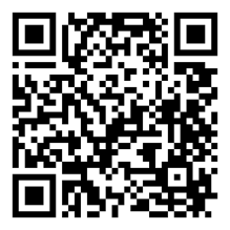
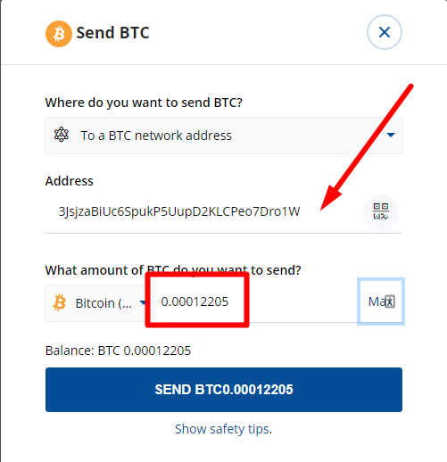
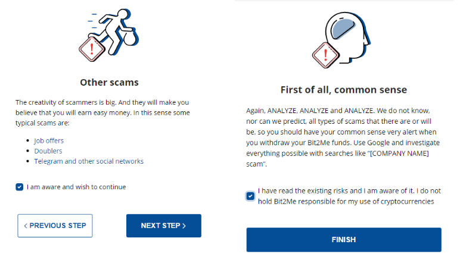
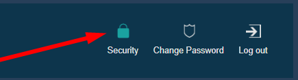
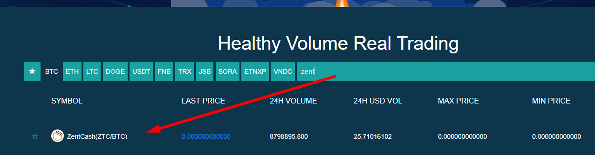
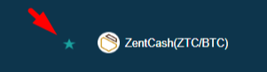

## **Index:**

1.  Đăng ký Bit2Me
2.  Làm cách nào để xác minh tài khoản Bit2Me của tôi? Từng bước một...
3.  Mua Bitcoin
4.  Đăng ký Finexbox
5.  Chuyển Bitcoin của bạn từ Ví Bit2Me sang Ví Finexbox của bạn
6.  Gửi Bitcoin đến Ví Finexbox của bạn
7.  Mua Zents
8.  Gửi Zents của tôi đến ví của riêng tôi

## 1. Đăng ký Bit2Me

Truy cập vào Bit2Me: <https://bit2me.com/register?r=AOP-U0D-KIU>

Tất cả những gì bạn phải làm là vào phần Access hoặc nhấp vào [Liên kết](https://bit2me.com/es/registro?r=AOP-U0D-KIU).

[**Thêm**]  <https://support.bit2me.com/en/support/home> Thông tin Bit2Me

Chúng tôi nhấp vào nút Đăng ký. Nhập email và mật khẩu của bạn. Chấp nhận các điều khoản và điều kiện mà chúng tôi trình bày cho bạn. Sau đó, bạn chỉ cần nhấp vào nút Đăng ký.

Khi bạn đã đăng ký, hãy nhập email của bạn và bạn sẽ tìm thấy thông báo Bit2Me này để xác minh tài khoản của mình. Nhấp vào **Xác nhận** **Email**. Nếu nút không hoạt động, hãy sao chép liên kết đính kèm vào trình duyệt của bạn để xác nhận. Bằng cách dễ dàng và đơn giản này, bạn sẽ được xác minh tài khoản email của mình. (Nếu bạn chưa nhận được thư, hãy nhấp vào biểu tượng **Gửi lại Email** Nút. 

> Hãy nhớ kiểm tra thư mục spam của bạn là tốt

Khi xác nhận tài khoản, bạn có thể chỉnh sửa hồ sơ, tạo tên người dùng và liên kết số điện thoại của mình nếu muốn.

Xin chúc mừng, bạn đã là người dùng Bit2Me! Sau khi đăng ký, bạn tiến gần hơn một bước đến tiền điện tử. Nếu bạn muốn cung cấp cho các nhấp chuột sau vào nút dưới đây để bắt đầu với việc tạo ví của bạn trong [Ví Bit2Me](https://wallet.bit2me.com/). TẠO VÍ NGAY BÂY GIỜ!

## 2. Làm cách nào để xác minh tài khoản Bit2Me của tôi? Từng bước một...

Để mua và bán trên Bit2Me, bạn cần xác minh tài khoản. Để làm điều này, trước tiên chúng ta phải điền dữ liệu của mình (tên, họ, số nhận dạng, quốc tịch, ngày sinh ...)

1.  Chúng tôi mở trang Bit2Me và nhấp vào **Truy cập** (ở trên cùng)

    

2.  Chúng tôi kết nối với email và mật khẩu của chúng tôi.

    

3.  Một khi **Tổng quát** hồ sơ (email, người dùng và điện thoại) đã hoàn thành, chúng tôi đi đến **Identity** để hoàn tất xác minh.

    

4.  **Xác minh được thực hiện theo 3 bước:** THÔNG TIN, DANH TÍNH VÀ TẢI ẢNH LÊN Để chụp ảnh chính xác, bạn có thể làm theo hướng dẫn của chúng tôi tại đây: [Bạn nên chụp ảnh đăng ký như thế nào?](https://support.bit2me.com/en/support/solutions/articles/35000051157-how-should-you-take-the-registration-photos-)

5.  Khi tất cả dữ liệu đã được điền vào, Bộ phận Xác minh của chúng tôi sẽ chịu trách nhiệm xác minh và chấp nhận hoặc từ chối cho biết lý do (Bài viết: Tại sao xác minh của tôi bị từ chối?)

> Youtube (tiếng Tây Ban Nha): [👩 🏫 hướng dẫn como COMPRAR BITCOIN fácil con TARJETA de débito en Bit2Me](https://www.youtube.com/watch?v=u2yXd0pTr5k) 

## 3. Mua Bitcoin

Bây giờ bạn có thể nhận Bitcoin bằng thẻ tín dụng, chuyển khoản ngân hàng và các hệ thống thanh toán khác.

Nhấp vào nút Mua và chọn:

-   Bạn muốn mua gì? --> Bitcoin (BTC)
-   Bạn muốn trả bao nhiêu? --> Chọn số tiền bạn muốn mua
-   Bạn muốn nhận chúng ở đâu? --> có thể chọn ví Bitcoin của mình hoặc thêm nhiều ví hơn
-   Chọn cách bạn muốn thanh toán

Bây giờ chúng tôi có thể gửi Bitcoin của chúng tôi đến ví Finexbox của chúng tôi

## 4. Đăng ký Finexbox

Đi tới [finexbox.com](https://www.finexbox.com/Reg/register/referrer/371)

 Nhấp vào nút đăng ký

Nhập email Gmail của bạn nếu có thể và mật khẩu hai lần

`(Password length between 6-20 english characters or number)`

\* Nếu bạn muốn, bạn có thể thêm ID giới thiệu: **371\***

Finexbox triển khai hệ thống bảo mật hai bước để ngăn chặn hành vi trộm cắp tiền điện tử, để ngay cả khi họ tìm ra mật khẩu của bạn, họ sẽ không thể nhập mà không có mã được tạo cứ sau 30 giây trên điện thoại di động của bạn.

Ví dụ, chúng ta có thể sử dụng [**Trình xác thực Google**](https://play.google.com/store/apps/details?id=com.google.android.apps.authenticator2&hl=es&gl=US)hoặc cho Apple với [Authenticato‪r](https://apps.apple.com/es/app/authenticator/id766157276).

## 5. Chuyển Bitcoin của bạn từ Ví Bit2Me sang Ví Finexbox của bạn

-   Chuyển đến phần số dư và tìm biểu tượng Bitcoin/BTC.
-   Nhấp vào nút ở bên phải cho biết **tiền gửi**.

Finexbox sẽ tạo ra một Ví Bitcoin duy nhất cho bạn

Sao chép địa chỉ Wallet của bạn

## 6. Gửi Bitcoin đến Ví Finexbox của bạn

Mở ví Bit2Me của bạn

### Chấp nhận tất cả cảnh báo bảo mật

 

Bit2Me sẽ gửi cho bạn một tin nhắn đến điện thoại của bạn, với mã bảo mật.

> :cảnh báo: Việc chuyển giao là **không tức thời**, có thể mất tới 30-45 phút.

## 7. Mua Zents

-   Quay lại màn hình chính của Finexbox
-   Đầu tiên, định cấu hình yếu tố xác thực thứ hai bằng cách nhấp vào nút Bảo mật trong bảng điều khiển người dùng của bạn, đây là thao tác một lần.

Sau khi cấu hình hoàn tất, chúng ta có thể tiếp tục.

-   Kiểm tra xem bitcoin của bạn đã đến chưa

-   Khi họ đã đến, nhấp vào logo Finexbox, ở góc trên bên trái
-   Bạn sẽ thấy tất cả các loại tiền tệ có thể được trao đổi và phía trên chúng là một thanh màu xanh nhạt trên đó tab BTC được đánh dấu.
-   Ở bên phải của nó, bạn có thể nhập để tìm kiếm đơn vị tiền tệ

> :cảnh báo: nếu bạn đang truy cập từ điện thoại thông minh, bạn sẽ phải đặt nó **Theo chiều ngang**. 

-   Nhập ZTC và bạn sẽ chỉ thấy cặp chúng tôi quan tâm đến ZentCash (ZTC / BTC)

-   Nhấp vào nó

-   Bạn sẽ vào bảng trao đổi BTC cho ZTC.

-   Nhấp vào ngôi sao:
    
-   Cuộn xuống cuối bảng điều khiển nơi bạn sẽ thấy cả hai **Mua** Và **lệnh bán**.

Các **Bên trái** là những người muốn **Mua** Zents, **Bên phải** là những người muốn **Bán** Zents.

Bạn có thể thử bán Zents và / hoặc mua chúng với giá bạn muốn, nếu bạn muốn mua hoặc bán ngay lập tức, chỉ cần chọn **đơn hàng đầu tiên** trong mỗi cột.

**Cách mua:**

-   Chọn cái đầu tiên **cột màu đỏ** hàng bên phải.
-   Dữ liệu sẽ xuất hiện trong màu xanh lá cây **Mua** Hộp.
-   Nhấp vào biểu tượng **Mua** Nút

**Cách bán:**

-   Chọn cái đầu tiên **cột màu xanh lá cây** hàng bên trái.
-   Dữ liệu sẽ xuất hiện trong màu xanh lá cây **Bán** Hộp.
-   Nhấp vào biểu tượng **Bán** Nút

### Tôi có thể bán với một mức giá nhất định không?

Tất nhiên, Nếu bạn muốn mua với một mức giá nhất định

-   Nếu bạn muốn đặt giá trao đổi cụ thể, hãy nhập giá đó vào trường "Giá" của cột "Mua đơn đặt hàng" và đặt số lượng bạn muốn mua vào trường "Khối lượng".

|  |  |
| ---------------------------------------------- | -------------------------------------------- |
|                                                |                                              |

Bạn có thể Hủy đơn hàng:

#### 💃💃**Xin chúc mừng, bạn đã có Zents của bạn!** 💃💃

## 8. Gửi Zents của tôi vào ví của riêng tôi

Chúng tôi khuyên bạn nên lưu trữ Zents trong ví cá nhân, vì điều này bạn có [Ví Zent trên Web](https://wallet.zent.cash/) Và [Ứng dụng di động](https://play.google.com/store/apps/details?id=cash.zent.mobileapp&hl=es&gl=US), hiện tại nó chỉ dành cho Android. 

-   <https://play.google.com/store/apps/details?id=cash.zent.mobileapp&hl=es&gl=US> 
-   <https://wallet.zent.cash/>

Nhấp vào email của bạn ở góc trên cùng bên phải, nó sẽ đưa bạn đến bảng điều khiển người dùng của bạn.

Nhấp vào Ẩn số dư bằng không: 

Trong báo chí hàng Zent **Rút** Nút:

**Ví Zent của riêng bạn**

Để rút Zent Cash của bạn, bạn cần ví của riêng mình bên ngoài Finexbox Exchanger, bạn có thể sử dụng ứng dụng di động, ví web hoặc Zent Binary để tạo ví của riêng bạn.

Sao chép địa chỉ của bạn từ ứng dụng di động, ví web hoặc zent nhị phân.

Nhấp vào **+Thêm địa chỉ** và dán địa chỉ ví của bạn

-   Sau đó chọn Zents bạn muốn gửi (**Tối đa 2,5 triệu**)
-   Nhấp vào **Nút Gửi →** Nó sẽ gửi đến email của bạn một mã 4 chữ số, khi nó đến viết nó xuống trong trường ở bên trái của nút Gửi.
-   Cuối cùng, mở ứng dụng Authenticator và sao chép các số được tạo ngẫu nhiên mỗi giây X, trong trường Khóa từ Google 2FA
-   Nhấn nút **Giao dịch** Nút

Đơn đặt hàng của bạn sẽ xuất hiện trong Lịch sử rút tiền dưới dạng đang chờ xử lý.

> :warning:Có thể mất đến 24 giờ để thực hiện. 

> 🚧
> **Vì lý do bảo mật, bạn có thể không thấy thông báo "Đã hoàn thành" khi thực hiện giao dịch, nhưng một thông báo cho biết, nếu trong 5 phút nó không xuất hiện trong lịch sử, bạn phải gửi email đến bộ phận hỗ trợ của Finexbox, trong trường hợp này, hãy gửi cho họ một email để kích hoạt lại Rút tiền. **
> 🚧
